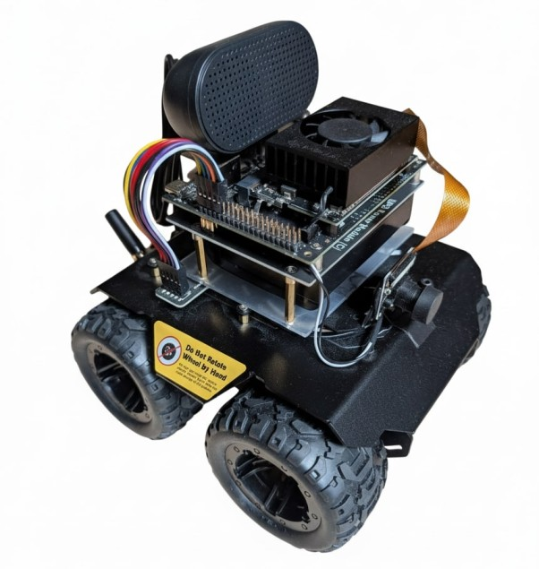

# Local AI Robot Assistant

A fully autonomous, privacy-preserving AI robot assistant running entirely on NVIDIA Jetson Orin Nano.



## 🚀 Features

- 🎤 **Voice Interaction**: Wake word detection, speech-to-text, and natural language understanding
- 👁️ **Computer Vision**: Real-time object detection and depth estimation
- 🧭 **Reactive Navigation**: Visual target approach with a verification loop (no map/SLAM for the MVP)
- 🧠 **On-Device AI**: Moondream VLM served locally (Ollama by default; optional in-process llama.cpp)
- 🔒 **Privacy-First**: Zero cloud dependencies, all processing on-device
- 🌐 **Web Monitoring**: Minimal FastAPI `/health` + `/status` endpoint

## 📋 Hardware Requirements

- NVIDIA Jetson Orin Nano Developer Kit (8GB)
- Wave Rover robot chassis
- IMX219 camera (160° FOV)
- USB microphone
- USB speakers
- NVMe SSD (256GB+)

[Full hardware list →](docs/guides/hardware_setup.md)

## 🛠️ Quick Start

### 1. Setup Hardware
```bash
# Follow the hardware setup guide
docs/guides/hardware_setup.md
```

### 2. Install Software
```bash
# Clone the repository
git clone https://github.com/imanolgo/local-ai-robot-assistant.git
cd local-ai-robot-assistant

# Run installation script
./setup.sh
```

### 3. Download Models
```bash
# Download all required AI models
./scripts/setup/download_models.sh
```

### 4. Calibrate Camera
```bash
# Calibrate the fisheye camera
python3 hardware_tests/calibrate_camera.py
```

### 5. Launch Robot
```bash
# Start all systems
ros2 launch launch/full_system_launch.py
```

[Detailed installation guide →](docs/guides/software_installation.md)

## 📚 Documentation

- [Architecture Overview](docs/architecture.md)
- [Product Requirements](docs/prd.md)
- [Hardware Setup Guide](docs/guides/hardware_setup.md)
- [Software Installation Guide](docs/guides/software_installation.md)
- [Quick Start Guide](docs/guides/quick_start.md)
- [Troubleshooting](docs/guides/troubleshooting.md)
- [API Documentation](docs/api/)

## 🧪 Testing

### Run Unit Tests
```bash
colcon test
colcon test-result --verbose
```

### Run Hardware Tests
```bash
python3 hardware_tests/test_waveroever_uart.py
python3 hardware_tests/test_camera_capture.py
python3 hardware_tests/test_audio_devices.py
```

### Run Integration Tests
```bash
python3 integration_tests/test_full_system.py
```

## 📊 Project Status

See [STATUS.md](STATUS.md) for detailed implementation progress.

**Current Phase**: Phase 7/8 - Cognitive Core + Behavioral Architecture
**Completion**: ~82% (see [STATUS.md](STATUS.md))
**Scope note**: SLAM/localization is out of scope for the MVP — see [docs/architecture.md](docs/architecture.md) v4.0.

## 🤝 Contributing

We welcome contributions! Please see [CONTRIBUTING.md](CONTRIBUTING.md) for guidelines.

## 📄 License

This project is licensed under the MIT License - see [LICENSE](LICENSE) for details.

## 🙏 Acknowledgments

- NVIDIA for JetPack SDK and NanoLLM
- ROS2 community
- OpenAI for Whisper
- Ultralytics for YOLO
- Vikhyat Korrapati / Moondream team
- NVIDIA-AI-IOT for `jetson-device-skills`

## 📞 Support

- Issues: [GitHub Issues](https://github.com/imanolgo/local-ai-robot-assistant/issues)
- Discussions: [GitHub Discussions](https://github.com/imanolgo/local-ai-robot-assistant/discussions)
