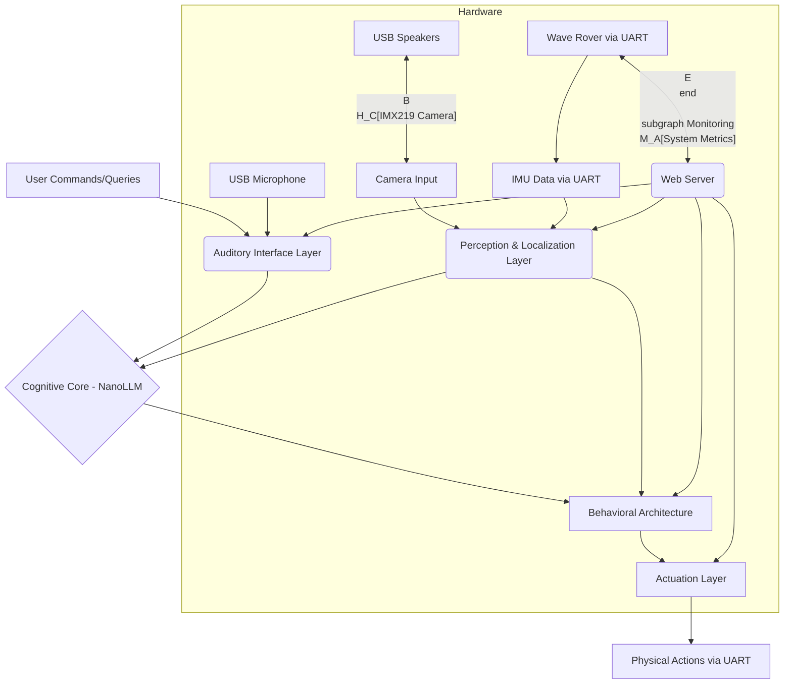

# Architecture Document: Local, Real-Time Autonomous AI Assistant
## Version 2.0 - Optimized for Jetson Orin Nano

## 1. Project Goal

The primary objective is to develop a local, real-time, multimodal AI robot assistant capable of understanding and fulfilling natural language commands with a high degree of agency. This assistant will operate entirely on the NVIDIA Jetson Orin Nano Developer Kit, leveraging its edge AI capabilities to ensure low latency, enhanced privacy, and offline autonomy.

### Core Capabilities:
- **Multimodal Interaction**: The robot will "see" via a camera, "hear" through a USB microphone with wake word detection, and "talk" through USB speakers using local TTS.
- **Real-time Perception and Mapping**: Continuous object detection and monocular depth estimation will feed a 3D SLAM system to provide a rich, spatial understanding of the environment.
- **Intelligent Command Understanding**: A small, local Language Model (LLM) will interpret complex natural language commands in the context of the robot's map and visual information.
- **Autonomous Agency**: The robot will possess the business logic to make decisions, plan actions, and handle unexpected situations to fulfill its missions.
- **Local Operation**: All processing will occur on the Jetson Orin Nano, eliminating reliance on cloud services.

## 2. System Architecture

The robot's architecture is designed as a modular, layered system, built upon the Robot Operating System 2 (ROS2) for robust inter-process communication and extensibility.

### 2.1. High-Level Overview

The system consists of six primary layers:
1. **Hardware Abstraction Layer**: Direct interfaces with physical sensors (camera, IMU via UART) and actuators (motors via UART, USB audio devices).
2. **Perception & Localization Layer**: Processes raw sensor data into meaningful environmental understanding (object detection, depth estimation, SLAM, and pose estimation).
3. **Auditory Interface Layer**: Handles all human-robot voice interaction via USB audio devices with local wake word detection, ASR, and TTS models.
4. **Cognitive Core**: Provides high-level reasoning and command interpretation using a local Language Model (LLM).
5. **Behavioral Architecture (Business Logic)**: Orchestrates robot actions, decision-making, and mission management using Behavior Trees.
6. **Actuation Layer**: Translates high-level commands into low-level motor controls via UART JSON commands.



### 2.2. ROS2 as the Backbone

ROS2 serves as the foundational middleware:
- **Nodes**: Each functional component will be implemented as a separate ROS2 node
- **Topics**: Data streams communicated via ROS2 topics
- **Services/Actions**: High-level commands handled via ROS2 services or actions
- **Parameter Server**: Dynamic configuration of nodes

### 2.3. Perception & Localization Layer

This layer provides environmental understanding and localization.

#### Camera Interface & Calibration
- **ROS2 Camera Node**: Interfaces with the **IMX219 160° FOV MIPI CSI-2 camera** to publish raw video frames
- **Calibration**: Offline calibration using OpenCV or NVIDIA VPI with checkerboard pattern to generate intrinsic parameters and fisheye distortion coefficients
- **Undistortion Node**: Subscribes to raw images, applies undistortion transform, publishes corrected images for downstream tasks

#### IMU and Odometry Fusion
- **UART IMU Node**: Communicates with Wave Rover via UART (JSON command `{"T":126}`) to retrieve IMU data including:
  - Heading angle
  - Geomagnetic field
  - Acceleration
  - Attitudes (roll, pitch, yaw)
  - Temperature
- **Data Publishing**: Parses JSON responses and publishes to `/imu/data` topic in `sensor_msgs/Imu` format at **50 Hz** (increased from 10-20 Hz for better fusion)
- **Odometry Estimation**: Since Wave Rover motors lack encoders, odometry will be estimated from:
  - IMU integration for orientation (primary for rotation)
  - Visual odometry from SLAM (primary for translation)
  - Dead reckoning from commanded velocities (backup only, high uncertainty)
- **Sensor Fusion**: The `robot_localization` package (EKF) will fuse:
  - IMU data (orientation, angular velocity) - **50 Hz**
  - Visual odometry from RTAB-Map - **10-30 Hz** (variable)
  - Commanded velocity estimates (with appropriate covariance)
- **Fallback Modes**:
  - **IMU-Only Mode**: When visual odometry fails (darkness, low texture)
  - **Dead Reckoning Mode**: Short-term backup during sensor failures

#### Real-time Object Detection
- **Model**: YOLOv8n optimized with **TensorRT FP16**
- **Pipeline**: DeepStream-based for hardware acceleration
- **Output**: Bounding boxes and class labels published to `/perception/objects`
- **Performance Target**: 20+ FPS at 640x480 resolution

#### Monocular Depth Estimation
- **Model**: **FastDepth** converted to **TensorRT FP16 engine**
- **Input**: Undistorted color images
- **Output**: Per-pixel depth maps published to `/perception/depth`
- **Performance Target**: 15+ FPS at 320x240 resolution

#### Simultaneous Localization and Mapping (SLAM)
- **Point Cloud Generation**: Back-project depth maps using calibrated camera intrinsics
- **SLAM System**: **RTAB-Map** (Real-Time Appearance-Based Mapping)
  - Primary odometry source for robot localization
  - Generates 3D map with semantic landmarks from YOLO detections
  - Loop closure detection for drift correction
- **Output**: 3D map and continuous robot pose at 10-30 Hz

### 2.4. Auditory Interface Layer

This layer handles all voice interaction using local models and USB audio hardware.

#### Hardware Components
- **USB Microphone**: Standard USB microphone for audio input
- **USB Speakers**: Standard USB speakers for audio output
- Both devices connect to separate USB ports on the Jetson

#### Audio Processing Pipeline

##### Input Pipeline (Speech Recognition)
1. **Audio Capture Node** (`audio_capture_node.py`)
   - Uses PyAudio or ALSA to capture audio from USB microphone
   - Publishes raw audio stream to `/audio/raw` topic at 16 kHz
   - Implements circular buffer for continuous audio monitoring
   - Health monitoring for USB device disconnection

2. **Wake Word Detection Node** (`wake_word_detector_node.py`)
   - Subscribes to `/audio/raw`
   - Runs lightweight wake word detection model: **openWakeWord** (recommended)
   - When wake word detected, publishes trigger to `/audio/wake_word_detected`
   - Continues monitoring in background
   - Target: <5% CPU usage, <100ms detection latency

3. **Speech-to-Text Node** (`stt_node.py`)
   - Activated by wake word detection
   - Captures audio segment with VAD (Voice Activity Detection)
   - Runs local ASR model:
     - **Primary**: **faster-whisper Tiny** (CTranslate2 optimized) OR
     - **Alternative**: **Whisper Tiny TensorRT engine**
   - Transcribes speech to text
   - Publishes transcribed text to `/audio/transcribed_text`
   - Returns to idle state after silence detected
   - Target: <2 second latency for 5-second utterance

##### Output Pipeline (Speech Synthesis)
1. **Text-to-Speech Node** (`tts_node.py`)
   - Subscribes to `/audio/tts_request` topic
   - Runs local TTS model:
     - **Primary**: **Piper** (fast, ONNX format is sufficient)
     - **Alternative**: **Coqui TTS** lightweight models
   - Synthesizes speech audio from text
   - Publishes audio to `/audio/tts_output`
   - Target: <500ms synthesis for typical sentence

2. **Audio Playback Node** (`audio_playback_node.py`)
   - Subscribes to `/audio/tts_output`
   - Uses PyAudio or ALSA to play audio through USB speakers
   - Manages audio queue and playback state
   - Handles interruptions (emergency stop, new commands)

#### Auditory Layer State Machine
```
[Listening for Wake Word]
    ↓ (wake word detected)
[Recording Command]
    ↓ (silence detected / timeout)
[Processing Speech → Text]
    ↓
[Command sent to Cognitive Core]
    ↓
[Response generated]
    ↓
[Text → Speech Synthesis]
    ↓
[Audio Playback]
    ↓
[Return to Listening for Wake Word]
```

#### Resource Optimization
- Wake word detection runs continuously but uses minimal resources (~5% CPU)
- ASR model lazy-loaded on wake word detection
- TTS model kept in memory (small footprint with Piper)
- Use INT8 quantization where possible

### 2.5. Cognitive Core (Language Model)

The cognitive core provides language-based reasoning.

#### Model Selection
- Quantized LLM of **~2-7 billion parameters** using **NVIDIA NanoLLM**
- Candidates: **LLaMA-2 7B INT4**, **Gemma 2-7B INT4**, or **Phi-2 INT8**
- INT4 quantization to fit within memory budget
- Model is **lazy-loaded** only when complex reasoning required

#### Input
- Transcribed text from `/audio/transcribed_text`
- Structured world state from Behavioral Architecture:
  - Robot's current pose and orientation
  - Semantic map (objects and coordinates from RTAB-Map)
  - Mission status
  - Recent IMU readings (orientation, movement state)
  - Formatted as structured prompt with JSON context

#### Output
- Structured intent (JSON format) to Behavioral Architecture
  - Example: `{"action": "navigate", "target": "red_ball", "coordinates": [x, y, z]}`
- Natural language response text to `/audio/tts_request`

#### Strategic Activation
- Invoked only when complex language understanding required
- Simple commands ("stop", "turn left") handled directly by Behavioral Architecture
- Memory management: Unload LLM when not in use if RAM pressure detected

#### Performance Targets
- Inference time: <3 seconds for typical command interpretation
- RAM usage: <2.5 GB (INT4 quantized)

### 2.6. Behavioral Architecture (Business Logic)

The primary decision-making engine using Behavior Trees.

#### Framework
- **BehaviorTree.CPP** integrated with ROS2

#### Interaction
- Receives robot pose and map data from Perception & Localization Layer
- Processes simple commands from Auditory Layer directly
- Processes complex intents from Cognitive Core
- Dispatches action goals to Actuation Layer
- Manages dialogue state and TTS requests
- Implements safety monitors and emergency stop

#### World Model (Blackboard)
- Blackboard contains:
  - Robot state (pose, orientation from IMU, motion state)
  - Semantic map of objects and locations
  - Current mission and goals
  - IMU-derived motion state (moving, stationary, stuck)
  - Safety status (emergency stop, low battery, thermal throttling)
  - Audio system state (listening, processing, speaking)

#### Behavior Tree Enhancements
- **Command Router**: Routes simple commands directly, complex to LLM
- **Stuck Detection**: Uses IMU accelerometer to detect if commanded motion is not occurring
- **Recovery Behaviors**: Automatic retry, alternate paths, user notification
- **Dialogue Management**: Coordinates with TTS for status updates and clarification questions
- **Safety Monitor**: Continuous monitoring of system health

#### Example Behavior Tree Structure
```xml
<BehaviorTree>
  <Sequence name="MainLoop">
    <SafetyCheck/>
    <ReactiveSequence>
      <EmergencyStop/>
      <ProcessCommand>
        <Fallback>
          <SimpleCommandHandler/>
          <ComplexCommandHandler>
            <InvokeLLM/>
            <ParseIntent/>
            <ExecuteAction/>
          </ComplexCommandHandler>
        </Fallback>
      </ProcessCommand>
    </ReactiveSequence>
  </Sequence>
</BehaviorTree>
```

### 2.7. Actuation Layer

Translates decisions into physical movement via UART communication.

#### UART Communication Node (`uart_motor_controller_node.py`)

##### Connection
- Communicates with Wave Rover ESP32 via UART interface
- Baud rate: 115200
- Serial device: `/dev/ttyTHS0` (hardware UART) or `/dev/ttyUSB0` (USB adapter)

##### Command Interface
Implements JSON command protocol:

1. **Movement Control** (Primary method)
   ```json
   {"T":1, "L":0.5, "R":0.5}
   ```
   - L: Left wheel speed (-0.5 to +0.5)
   - R: Right wheel speed (-0.5 to +0.5)
   - Values represent PWM percentage (0.5 = 100%, 0.25 = 50%)
   - Command rate: **20 Hz**

2. **IMU Data Retrieval**
   ```json
   {"T":126}
   ```
   - Query rate: **50 Hz** (handled by separate IMU node)

3. **Continuous Feedback** (Enable at startup)
   ```json
   {"T":131, "cmd":1}
   ```
   - Enables continuous chassis information feedback
   - Provides motor current, battery voltage, etc.

4. **OLED Display Control** (Optional)
   ```json
   {"T":3, "lineNum":0, "Text":"Status: Active"}
   ```
   - Display robot status on Wave Rover's OLED screen

##### ROS2 Integration
- **Subscribed Topics**:
  - `/cmd_vel` (geometry_msgs/Twist) - converts to wheel speeds at 20 Hz
  - `/motor_command` (custom msg) - direct wheel speed commands
- **Published Topics**:
  - `/motor_status` - feedback from continuous mode
  - `/chassis_state` - parsed chassis information
  - `/odom_raw` - dead reckoning estimate (low confidence)

##### Motor Control Logic
- **Differential Drive Kinematics**: Converts linear (v) and angular (ω) velocities to left/right wheel speeds
  ```
  L_speed = (v - ω * wheelbase/2) / max_speed
  R_speed = (v + ω * wheelbase/2) / max_speed
  ```
- **Command Rate**: 20 Hz for smooth control
- **Dead Reckoning**: Publishes rough odometry estimate with high covariance

##### Safety Features
- **Watchdog Timer**: Stops motors if no command received within 500ms
- **Emergency Stop Service**: `/emergency_stop` service
- **Speed Limiting**: Configurable max speed and acceleration
- **Retry Logic**: Automatic retry on communication failure

## 3. Model Optimization Strategy

### 3.1. Model Format Pipeline

**Critical**: All models follow this optimization path:

```
PyTorch/HuggingFace → ONNX (intermediate) → TensorRT Engine (deployment)
```

### 3.2. Model-Specific Strategies

#### Vision Models (YOLO, FastDepth)
- **Format**: TensorRT FP16 engines
- **Optimization**:
  - Layer fusion
  - Kernel auto-tuning for Jetson Orin
  - Dynamic batch size support
- **Tools**: `trtexec`, NVIDIA TAO Toolkit

#### Audio Models

**Wake Word (openWakeWord)**:
- **Format**: ONNX (lightweight enough)
- **Optimization**: CPU-optimized, minimal footprint
- **Fallback**: TensorRT if CPU usage exceeds 10%

**ASR (Whisper)**:
- **Primary**: faster-whisper (CTranslate2 pre-optimized)
- **Alternative**: Custom TensorRT conversion with FP16
- **Target**: Real-time factor < 0.3x

**TTS (Piper)**:
- **Format**: ONNX (already optimized for edge)
- **No conversion needed**: Designed for CPU inference

#### LLM (NanoLLM)
- **Format**: TensorRT-LLM (INT4 quantization)
- **Framework**: NVIDIA NanoLLM handles conversion
- **Models**: LLaMA-2 7B, Gemma 2-7B, or Phi-2
- **Optimization**: AWQ or GPTQ quantization

### 3.3. Conversion Utilities

Create standardized conversion scripts:
- `tools/convert_yolo.py` - YOLO → TensorRT
- `tools/convert_depth.py` - FastDepth → TensorRT
- `tools/convert_whisper.py` - Whisper → TensorRT/faster-whisper setup
- `tools/profile_model.py` - Benchmark any model

## 4. Memory Management Strategy

### 4.1. Revised RAM Budget (8GB Total)

| Component | Idle | Active | Notes |
|-----------|------|--------|-------|
| System/ROS2 | 1.0 GB | 1.2 GB | Base OS + ROS2 |
| RTAB-Map SLAM | - | 1.2 GB | Loaded on demand |
| YOLO TensorRT | - | 600 MB | Unload when LLM active |
| Depth TensorRT | - | 400 MB | Unload when LLM active |
| Audio Models | 300 MB | 500 MB | Wake word always loaded |
| NanoLLM (INT4) | - | 2.5 GB | Lazy load only when needed |
| Web Server | - | 200 MB | Optional, can disable |
| Buffers/Other | 500 MB | 800 MB | |
| **Available Buffer** | **6.2 GB** | **1.6 GB** | Safety margin |

### 4.2. Dynamic Model Loading

**Perception Mode** (default):
- SLAM + YOLO + Depth active
- LLM unloaded
- RAM usage: ~4.5 GB

**Reasoning Mode** (complex commands):
- Load LLM
- Keep SLAM active (for context)
- Optionally unload YOLO/Depth temporarily
- RAM usage: ~5.5 GB

**Emergency Mode** (RAM pressure):
- Unload all AI models except wake word
- Basic motor control only
- RAM usage: ~2 GB

### 4.3. Memory Pressure Monitoring

- Monitor available RAM every second
- Trigger model unloading at 85% usage
- Disable web server at 90% usage
- Log warnings and notify user

## 5. Monitoring and User Interface

### 5.1. Web Server Architecture
- **Backend**: FastAPI with WebSocket support (lightweight)
- **Frontend**: Simple HTML/CSS/JavaScript dashboard
- **Data Flow**: ROS2 bridge node pushes data via WebSockets

### 5.2. Monitoring Dashboard

**System Health**:
- CPU/GPU utilization (per core)
- RAM usage (total and per process)
- Temperature (CPU, GPU, thermal zones)
- Power consumption
- Disk usage

**Perception Data**:
- Live camera feed (throttled to 5 FPS for web)
- Object detection overlays
- Depth map visualization
- SLAM map viewer

**Audio Status**:
- Wake word detection state
- ASR/TTS activity indicators
- Audio latency metrics

**Robot State**:
- Current pose and orientation
- Mission status and progress
- Battery level (from UART feedback)
- Error logs and warnings

**AI Model Status**:
- Which models are currently loaded
- Inference times (YOLO, Depth, LLM)
- Memory usage per model

### 5.3. Resource Management
- Web server can be disabled via config
- Throttle data transmission (1 Hz for non-critical data)
- Minimal JavaScript (no heavy frameworks)

## 6. Tech Stack

### 6.1. Hardware
- **Main Compute**: NVIDIA Jetson Orin Nano Developer Kit (8GB)
- **Robot Platform**: Wave Rover robot chassis with 9-axis IMU (accessible via UART)
- **Perception Sensors**:
  - **Camera**: IMX219 8MP MIPI CSI-2 camera with 160° fisheye lens
- **Audio Peripherals**:
  - **Input**: USB Microphone
  - **Output**: USB Speakers
- **Communication**: UART connection to Wave Rover (baud rate: 115200)
- **Storage**: NVMe SSD (256GB+ recommended, with 16GB swap partition)

### 6.2. Software & Frameworks
- **Operating System**: Ubuntu 20.04/22.04 (NVIDIA JetPack SDK 5.x or 6.x)
- **Robotics Middleware**: ROS2 Humble
- **Deep Learning Frameworks**: PyTorch, TensorRT, NVIDIA JetPack (CUDA, cuDNN)

#### AI Models & Libraries
- **Object Detection**: Ultralytics YOLOv8n (TensorRT FP16)
- **Monocular Depth**: FastDepth (TensorRT FP16)
- **Localization/Mapping**: `robot_localization` (EKF), `rtabmap_ros`
- **Camera Processing**: OpenCV, NVIDIA VPI (fisheye calibration)
- **Language Model**: NVIDIA NanoLLM with LLaMA-2/Gemma/Phi-2 (INT4)

#### Audio Models & Libraries
- **Wake Word Detection**: openWakeWord (ONNX)
- **Speech-to-Text**: faster-whisper (CTranslate2) OR Whisper Tiny (TensorRT)
- **Text-to-Speech**: Piper (ONNX)
- **Audio I/O**: PyAudio or python-sounddevice
- **VAD**: webrtcvad or silero-vad

#### Other Libraries
- **Serial Communication**: pySerial (UART to Wave Rover)
- **Behavior Tree**: BehaviorTree.CPP
- **Web Server**: FastAPI with WebSocket support
- **Model Conversion**: ONNX, TensorRT, trtexec

### 6.3. Programming Languages
- **Primary**: Python (most ROS2 nodes)
- **Secondary**: C++ (performance-critical nodes, BehaviorTree.CPP)
- **Frontend**: HTML, CSS, JavaScript (minimal)

## 7. Development Best Practices

### 7.1. Modular and Component-Based Design
- Encapsulate functionality in distinct ROS2 nodes with well-defined interfaces
- Each processing stage is a separate node for modularity
- Use ROS2 composition for performance-critical nodes

### 7.2. Performance Optimization
- **TensorRT Engines**: Use FP16/INT8 quantization for all vision models
- **DeepStream**: Use for YOLO inference with hardware acceleration
- **Zero-Copy**: Use NVMM buffers for camera pipeline
- **LLM Quantization**: INT4 via NanoLLM
- **Headless Operation**: No desktop environment (CLI only)
- **Swap File**: 16GB swap on NVMe SSD
- **Model Profiling**: Benchmark all models before deployment

### 7.3. Robustness and Error Handling
- **UART Communication**: Retry logic, timeout handling, JSON validation
- **Audio Pipeline**: USB device health monitoring, reconnection handling
- **Behavior Trees**: Fallback behaviors for every action
- **IMU Integration**: Data validation, outlier rejection
- **Visual Odometry**: IMU fallback when SLAM fails
- **Comprehensive Logging**: Debug logs with log rotation

### 7.4. Development Workflow
- **Version Control**: Git with feature branches
- **Containerization**: Docker for reproducible builds
- **Simulation**: Gazebo for initial algorithm testing
- **Hardware-in-Loop**: Progressive integration with real hardware
- **Continuous Integration**: Automated testing on commit

## 8. Safety and Recovery

### 8.1. Emergency Stop System
- **Physical Button**: Hardware emergency stop (if available)
- **Voice Command**: "emergency stop" / "stop immediately"
- **ROS2 Service**: `/emergency_stop` callable by any node
- **Behavior**: Immediate motor stop, clear command queue

### 8.2. Stuck Detection and Recovery
- **Detection**: Compare commanded velocity with IMU acceleration
- **Threshold**: No movement for 3 seconds with non-zero command
- **Recovery**:
  1. Stop and reverse for 1 second
  2. Rotate 45 degrees
  3. Retry original path
  4. If stuck 3 times, request user assistance

### 8.3. Thermal Management
- **Monitor**: CPU/GPU temperatures every second
- **Warning**: Log warning at 75°C
- **Throttle**: Reduce inference frequency at 80°C
- **Emergency**: Disable AI models at 85°C, motors only

### 8.4. Low Battery Protection
- **Monitor**: Battery voltage from UART continuous feedback
- **Warning**: TTS announcement at 20% battery
- **Safety**: Return to charging station at 10% (if implemented)
- **Emergency**: Stop all motion at 5%, keep wake word active

### 8.5. Graceful Degradation
- **Level 1**: Full capability (all models active)
- **Level 2**: Disable web UI (save 200 MB RAM)
- **Level 3**: Unload LLM (simple commands only)
- **Level 4**: Unload vision models (motor control only)
- **Level 5**: Emergency mode (wake word + motors only)

## 9. Testing Strategy

### 9.1. Unit Testing
- Test each ROS2 node independently
- Mock dependencies (serial ports, camera, etc.)
- Validate data transformations
- Measure performance metrics

### 9.2. Integration Testing
- Test subsystem interactions (perception → behavior → actuation)
- Test audio pipeline end-to-end
- Test UART communication under load
- Test model loading/unloading

### 9.3. Performance Benchmarking
- Measure inference times for all models
- Measure end-to-end latency (voice command → action)
- Profile RAM usage under various scenarios
- Test thermal performance under sustained load

### 9.4. Failure Mode Testing
- USB device disconnection/reconnection
- UART communication errors and recovery
- Model inference failures
- Low memory conditions
- Visual odometry failures (darkness, blank walls)
- Stuck situations and recovery

### 9.5. Real-World Scenario Testing
- Navigate to specific objects
- Multi-turn conversations
- Operation in various lighting conditions
- Handling interruptions mid-task
- Complex command understanding

## 10. Project Structure

```
robot_assistant_project/
├── src/
│   ├── perception_nodes/
│   │   └── perception_nodes/
│   │       ├── camera_driver.py
│   │       ├── image_undistort_node.py
│   │       ├── object_detector.py (TensorRT)
│   │       └── depth_estimator.py (TensorRT)
│   ├── localization_nodes/
│   │   ├── launch/
│   │   │   └── localization_launch.py
│   │   └── src/
│   │       ├── uart_imu_node.py (50 Hz polling)
│   │       └── slam_node.py (RTAB-Map)
│   ├── audio_interface_nodes/
│   │   └── audio_interface_nodes/
│   │       ├── audio_capture_node.py
│   │       ├── wake_word_detector_node.py (openWakeWord)
│   │       ├── stt_node.py (faster-whisper or TensorRT)
│   │       ├── tts_node.py (Piper)
│   │       └── audio_playback_node.py
│   ├── cognitive_core_node/
│   │   └── cognitive_core_node/
│   │       ├── nanollm_interface.py (INT4)
│   │       └── model_manager.py (lazy loading)
│   ├── behavioral_nodes/
│   │   └── behavioral_nodes/
│   │       ├── behavior_tree_executor.py
│   │       ├── dialogue_manager.py
│   │       └── command_router.py (simple vs complex)
│   ├── actuation_nodes/
│   │   └── actuation_nodes/
│   │       └── uart_motor_controller.py (20 Hz)
│   ├── web_interface_nodes/
│   │   └── web_interface_nodes/
│   │       └── web_server.py (FastAPI)
│   └── monitoring_nodes/
│       └── monitoring_nodes/
│           ├── system_monitor.py (CPU/GPU/RAM)
│           └── memory_manager.py (dynamic model loading)
├── config/
│   ├── camera_calibration.yaml
│   ├── localization_config.yaml (EKF parameters)
│   ├── audio_config.yaml (device settings)
│   ├── uart_config.yaml (port, baud rate)
│   ├── behavior_tree_config.xml
│   └── memory_management.yaml (thresholds)
├── models/
│   ├── wake_word/ (openWakeWord ONNX)
│   ├── whisper_tiny_trt/ (TensorRT engine)
│   ├── piper_voice/ (ONNX + voice files)
│   ├── yolo_trt/ (TensorRT FP16 engine)
│   ├── depth_trt/ (TensorRT FP16 engine)
│   └── nanollm_quantized/ (INT4 model)
├── tools/
│   ├── convert_yolo.py
│   ├── convert_depth.py
│   ├── convert_whisper.py
│   ├── profile_model.py
│   └── calibrate_camera.py
├── launch/
│   ├── full_system_launch.py
│   ├── perception_launch.py
│   ├── audio_pipeline_launch.py
│   ├── slam_launch.py
│   └── minimal_launch.py (emergency mode)
├── tests/
│   ├── unit/
│   ├── integration/
│   ├── performance/
│   └── hardware/
├── docs/
│   ├── guides/
│   │   ├── jetson_setup.md
│   │   ├── model_conversion.md
│   │   └── troubleshooting.md
│   ├── architecture.md
│   └── api_reference.md
└── docker/
    ├── Dockerfile
    └── docker-compose.yml
```

## 11. Key Architectural Decisions & Rationale

### 11.1. TensorRT Over ONNX for Deployment
**Decision**: Use TensorRT engines, not ONNX, for production deployment
**Rationale**:
- 3-5x faster inference on Jetson
- Lower memory footprint with FP16/INT8
- Hardware-specific optimization
- ONNX used only as intermediate format

### 11.2. faster-whisper Over Custom TensorRT
**Decision**: Prefer faster-whisper (CTranslate2) for ASR
**Rationale**:
- Already optimized for edge devices
- Easier to integrate than custom TensorRT conversion
- Proven performance on Jetson platforms
- Active maintenance and support

### 11.3. Lazy Loading LLM
**Decision**: Load LLM only when complex reasoning required
**Rationale**:
- Saves 2.5 GB RAM during routine operations
- Most commands are simple (navigation, motor control)
- Loading time (~5 seconds) acceptable for complex queries
- Allows running perception pipeline continuously

### 11.4. 50 Hz IMU Polling
**Decision**: Increased from 10-20 Hz to 50 Hz
**Rationale**:
- Better data for EKF sensor fusion
- Critical for orientation tracking during fast turns
- Minimal overhead with efficient JSON parsing
- Standard rate for IMU data in robotics

### 11.5. Visual Odometry with Fallbacks
**Decision**: Primary odometry from SLAM with IMU fallback
**Rationale**:
- More accurate than dead reckoning from encoderless motors
- IMU provides reliable orientation even when SLAM fails
- Multiple fallback layers prevent complete localization failure
- Realistic for edge deployment

## 12. Future Enhancements

### 12.1. Short-Term (Post-MVP)
- Object grasping with additional hardware (gripper)
- Multi-robot coordination
- Improved natural language understanding (larger LLM)
- Voice activity detection improvements

### 12.2. Medium-Term
- Semantic SLAM (room understanding)
- Object tracking and following
- Autonomous charging station docking
- Mobile app for remote monitoring

### 12.3. Long-Term
- Transfer learning for custom objects
- Reinforcement learning for navigation
- Multi-lingual support
- Edge-cloud hybrid mode (optional cloud offload)

## References
- **automaticaddison.com**: IMU and wheel odometry fusion with `robot_localization`
- **forums.developer.nvidia.com**: Jetson Orin Nano optimization
- **jetson-ai-lab.com**: NVIDIA NanoLLM documentation
- **dusty-nv.github.io**: Jetson AI tools and examples
- **introlab.github.io**: RTAB-Map SLAM documentation
- **openai.com/research**: Whisper speech recognition
- **github.com/rhasspy/piper**: Piper TTS for edge devices
- **github.com/dscripka/openWakeWord**: Open-source wake word detection
- **github.com/systran/faster-whisper**: CTranslate2-optimized Whisper
- **docs.nvidia.com/deepstream**: DeepStream SDK documentation
- **developer.nvidia.com/tensorrt**: TensorRT optimization guide
