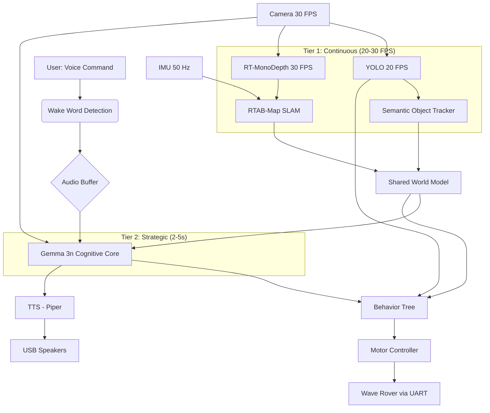

# Architecture Document: Local, Real-Time Autonomous AI Assistant
## Version 3.0 - Gemma 3n Multimodal Integration for Jetson Orin Nano

## 1. Project Goal

The primary objective is to develop a local, real-time, multimodal AI robot assistant capable of understanding and fulfilling natural language commands with a high degree of agency. This assistant will operate entirely on the NVIDIA Jetson Orin Nano Developer Kit, leveraging its edge AI capabilities to ensure low latency, enhanced privacy, and offline autonomy.

### Core Capabilities:
- **Native Multimodal Interaction**: The robot will "see" via camera, "hear" through USB microphone with wake word detection, and "talk" through USB speakers using local TTS. All sensory inputs can be processed directly by the cognitive core without intermediate translation layers.
- **Two-Tier Real-Time Perception**: Continuous low-level perception (YOLO, depth estimation, SLAM) runs at 20-30 FPS for reactive navigation, while strategic high-level reasoning (Gemma 3n) operates on-demand for complex command understanding and goal verification.
- **Direct Multimodal Reasoning**: A compact multimodal language model (Gemma 3n E2B) processes audio, vision, and text inputs directly, enabling sophisticated scene understanding, spatial reasoning, and visual goal verification.
- **Autonomous Agency**: The robot possesses the business logic to make decisions, plan actions, handle unexpected situations, and verify task completion autonomously.
- **Local Operation**: All processing occurs on the Jetson Orin Nano, eliminating reliance on cloud services.

## 2. System Architecture

The robot's architecture is designed as a modular, layered system with two-tier perception, built upon Robot Operating System 2 (ROS2) for robust inter-process communication and extensibility.

### 2.1. High-Level Overview

The system consists of six primary layers organized around a two-tier perception strategy:

1. **Hardware Abstraction Layer**: Direct interfaces with physical sensors (camera, IMU via UART) and actuators (motors via UART, USB audio devices).

2. **Tier 1 - Continuous Perception Layer**: Real-time processing at 20-30 FPS
   - Object detection (YOLO)
   - Depth estimation (RT-MonoDepth-S)
   - SLAM and localization
   - Semantic object tracking

3. **Auditory Interface Layer**: Streamlined audio processing with direct multimodal integration
   - Wake word detection (always-on)
   - Audio buffering for Gemma 3n (bypasses traditional ASR for complex scenarios)
   - Text-to-Speech for robot responses

4. **Tier 2 - Strategic Cognitive Core**: On-demand multimodal reasoning (2-5 second latency)
   - Direct audio understanding (Gemma 3n E2B)
   - Direct visual reasoning (Gemma 3n E2B)
   - Text-based command interpretation
   - Goal verification and strategy assessment

5. **Behavioral Architecture (Business Logic)**: Orchestrates robot actions using Behavior Trees
   - Command routing (simple vs. complex)
   - Continuous navigation with YOLO tracking
   - Multimodal goal verification
   - Safety monitoring and recovery

6. **Actuation Layer**: Translates high-level commands into low-level motor controls via UART



### 2.2. ROS2 as the Backbone

ROS2 serves as the foundational middleware:
- **Nodes**: Each functional component implemented as a separate ROS2 node
- **Topics**: Data streams communicated via ROS2 topics
- **Services/Actions**: High-level commands handled via ROS2 services or actions
- **Parameter Server**: Dynamic configuration of nodes
- **QoS Policies**: Optimized for real-time performance (best-effort for perception, reliable for commands)

### 2.3. Tier 1: Continuous Perception & Localization Layer

This layer provides real-time environmental understanding and localization, running continuously at 20-30 FPS.

#### Camera Interface & Calibration
- **ROS2 Camera Node**: Interfaces with **IMX219 160° FOV MIPI CSI-2 camera** to publish raw video frames at 30 FPS
- **Calibration**: Offline calibration using OpenCV or NVIDIA VPI with checkerboard pattern to generate intrinsic parameters and fisheye distortion coefficients
- **Undistortion Node**: Subscribes to raw images, applies undistortion transform, publishes corrected images to:
  - `/camera/image_undistorted` (for perception pipeline)
  - `/camera/snapshot` (for Gemma 3n on-demand processing)

#### IMU and Odometry Fusion
- **UART IMU Node**: Communicates with Wave Rover via UART (JSON command `{"T":126}`) at **50 Hz**
  - Heading angle, geomagnetic field, acceleration
  - Attitudes (roll, pitch, yaw)
  - Temperature monitoring
- **Data Publishing**: Publishes to `/imu/data` in `sensor_msgs/Imu` format
- **Sensor Fusion**: `robot_localization` package (EKF) fuses:
  - IMU data (orientation, angular velocity) - 50 Hz
  - Visual odometry from RTAB-Map - 10-30 Hz (variable)
  - Commanded velocity estimates (with high covariance)
- **Fallback Modes**:
  - **IMU-Only Mode**: When visual odometry fails
  - **Dead Reckoning Mode**: Short-term backup during sensor failures

#### Real-time Object Detection (YOLO)
- **Model**: YOLOv11n optimized with **TensorRT FP16**
- **Pipeline**: DeepStream-based for hardware acceleration
- **Performance**: 20+ FPS at 640x480 resolution
- **Output**: Published to `/perception/objects` with:
  - Bounding boxes and class labels
  - Object IDs (persistent tracking)
  - 3D coordinates (fused with depth data)

**Role**: Continuous object tracking for reactive navigation, obstacle avoidance, and semantic map updates

#### Monocular Depth Estimation
- **Model**: **RT-MonoDepth-S** converted to **TensorRT FP16 engine**
- **Performance**: 30+ FPS at 320x240 resolution
- **Output**: Per-pixel depth maps published to `/perception/depth`
- **Integration**: Fused with YOLO detections for 3D object localization

#### Simultaneous Localization and Mapping (SLAM)
- **Point Cloud Generation**: Back-project depth maps using calibrated camera intrinsics
- **SLAM System**: **RTAB-Map** (Real-Time Appearance-Based Mapping)
  - Primary odometry source for robot localization
  - Generates 3D map with semantic landmarks from YOLO detections
  - Loop closure detection for drift correction
- **Performance**: 10-30 Hz continuous pose updates
- **Output**: Robot pose and 3D semantic map to shared world model

#### Semantic Object Tracker (NEW)
- **Purpose**: Maintain persistent object identities across frames
- **Input**: YOLO detections + depth data
- **Processing**:
  - Assigns unique IDs to detected objects (e.g., `red_ball_id=5`)
  - Tracks object trajectories over time
  - Updates 3D positions in world coordinates
  - Handles object occlusion and reappearance
- **Output**: Published to `/perception/semantic_objects`
- **Integration**: Feeds Behavior Tree with real-time object locations for smooth navigation

### 2.4. Streamlined Auditory Interface Layer

This layer handles voice interaction with a **simplified, multimodal-first pipeline** that bypasses traditional ASR for complex scenarios.

#### Hardware Components
- **USB Microphone**: Standard USB microphone for audio input (16 kHz single channel)
- **USB Speakers**: Standard USB speakers for audio output
- Both devices connect to separate USB ports on the Jetson

#### Audio Processing Pipeline - Multimodal First Approach

##### Input Pipeline (Simplified)

**1. Audio Capture Node** (`audio_capture_node.py`)
   - Uses PyAudio or ALSA to capture audio from USB microphone
   - Publishes raw audio stream to `/audio/raw` topic at 16 kHz
   - Implements circular buffer for continuous audio monitoring
   - Health monitoring for USB device disconnection

**2. Wake Word Detection Node** (`wake_word_detector_node.py`)
   - Subscribes to `/audio/raw`
   - Runs lightweight **openWakeWord** model (ONNX, CPU-optimized)
   - When wake word detected, publishes trigger to `/audio/wake_word_detected`
   - Continues monitoring in background
   - Target: <5% CPU usage, <100ms detection latency

**3. Audio Buffer Node** (`audio_buffer_node.py`) - **NEW**
   - Activated by wake word detection
   - Captures audio segment with Voice Activity Detection (VAD)
   - **Primary Path**: Encodes audio at **6.25 tokens/second** for direct Gemma 3n processing
   - **Fallback Path**: Uses faster-whisper for simple text commands if needed
   - Publishes encoded audio to `/audio/multimodal_buffer`
   - VAD-based automatic silence detection (default: 2 seconds)
   - Target: <100ms buffering overhead

**Key Innovation**: Audio is prepared for **direct multimodal processing** by Gemma 3n, bypassing traditional ASR transcription for scenarios requiring audio context (tone, background sounds, multiple speakers).

##### Output Pipeline (Unchanged)

**1. Text-to-Speech Node** (`tts_node.py`)
   - Subscribes to `/audio/tts_request` topic
   - Runs local **Piper** TTS model (ONNX format)
   - Synthesizes speech audio from text
   - Publishes audio to `/audio/tts_output`
   - Target: <500ms synthesis for typical sentence

**2. Audio Playback Node** (`audio_playback_node.py`)
   - Subscribes to `/audio/tts_output`
   - Uses PyAudio or ALSA to play audio through USB speakers
   - Manages audio queue and playback state
   - Handles interruptions (emergency stop, new commands)

#### Streamlined Audio Detection State Machine

```text
[LISTENING_WAKE_WORD] ←──────────────────────┐
    ↓ (wake word detected)                    │
[CAPTURING_AUDIO]                             │
    ↓ (VAD detects speech end)                │
[AUDIO_ENCODED] → 6.25 tokens/sec            │
    ↓                                         │
[SENT_TO_GEMMA_3N] → Multimodal processing   │
    ↓ (2-5 seconds)                           │
[COMMAND_UNDERSTOOD]                          │
    ↓                                         │
[EXECUTING_ACTION] → YOLO tracking active    │
    ↓                                         │
[ROBOT_SPEAKING] → VAD disabled              │
    ↓ (speech complete)                       │
[BRIEF_PAUSE] → 0.5s delay                   │
    ↓                                         │
[RETURN_TO_WAKE_WORD] ───────────────────────┘
```

**Advantages of New Pipeline**:
- Eliminates Whisper ASR node (~500 MB RAM saved)
- Reduces latency (no transcription step for complex audio)
- Preserves audio context (tone, emotion, background sounds)
- Simpler state management
- Direct multimodal integration

### 2.5. Tier 2: Gemma 3n Multimodal Cognitive Core

The strategic reasoning layer provides on-demand multimodal understanding with 2-5 second latency for complex scenarios.

#### Model Specification
- **Model**: **Google DeepMind Gemma 3n E2B**
- **Parameters**: 5B total, 2B effective (MatFormer selective activation)
- **Memory Footprint**: Constant **2.0 GB VRAM** (regardless of active modalities)
- **Context Window**: 32K tokens (shared across text, audio, and vision)
- **Framework**: HuggingFace Transformers 4.53.0+
- **Optimization**: Runs entirely offline with bfloat16 precision

#### Multimodal Input Processing

**Audio Input** (NEW - Primary Path):
- **Source**: `/audio/multimodal_buffer` (encoded at 6.25 tokens/second)
- **Direct Processing**: Gemma 3n processes raw audio without ASR transcription
- **Use Cases**:
  - Complex commands with contextual audio
  - Ambient sound analysis
  - Speaker emotion and urgency detection
  - Multi-speaker scenarios

**Vision Input** (NEW):
- **Source**: `/camera/snapshot` (captured on-demand)
- **Resolutions**: 256x256 (fast), 512x512 (balanced), 768x768 (detailed)
- **Encoding**: 256 tokens per image
- **Use Cases**:
  - Scene understanding and spatial reasoning
  - Object identification and relationships
  - Goal verification ("Am I at the target?")
  - Strategy assessment ("Is this path clear?")

**Text Input** (Structured Context):
- **Source**: Shared world model from Behavior Tree
- **Contents**:
  - Robot pose and orientation
  - Semantic map (objects with IDs and coordinates)
  - Mission status and history
  - IMU-derived motion state
  - Recent YOLO detections

**Fallback Text Mode**:
- For simple commands, faster-whisper can still provide text transcription
- Gemma 3n processes text-only for faster inference (<2 seconds)

#### Output Formats

**Structured Intent (JSON)**:
```json
{
  "action": "navigate",
  "target": "red_ball_id=5",
  "coordinates": [2.3, 1.1, 0.0],
  "confidence": 0.95,
  "strategy": "direct_path",
  "visual_confirmation_required": true
}
```

**Goal Verification (JSON)**:
```json
{
  "goal_achieved": true,
  "confidence": 0.92,
  "explanation": "Robot is positioned 0.3m from red ball",
  "next_action": "mission_complete"
}
```

**Natural Language Response**: Published to `/audio/tts_request` for Piper synthesis

#### Strategic Activation

**Invocation Triggers**:
1. Complex command received (audio + current camera frame + world state)
2. Goal verification requested (camera snapshot + mission context)
3. Strategy assessment needed (camera snapshot + navigation status)
4. Stuck detection recovery (scene analysis for alternative paths)

**Not Invoked For**:
- Simple commands ("stop", "turn left", "go forward") - handled by Behavior Tree directly
- Continuous perception - YOLO/SLAM run independently
- Routine navigation - YOLO tracking provides real-time object positions

#### Performance Targets
- **Command Understanding**: <3 seconds (audio + vision + text processing)
- **Goal Verification**: <2 seconds (vision + text processing)
- **Memory**: Constant 2.0 GB VRAM
- **Availability**: Lazy-loaded on first complex command, kept in memory during operation

### 2.6. Behavioral Architecture - Multimodal Integration

The primary decision-making engine using Behavior Trees, orchestrating the two-tier perception strategy.

#### Framework
- **BehaviorTree.CPP** integrated with ROS2
- **Execution Rate**: 10 Hz main loop

#### World Model (Blackboard) - Enhanced

**Tier 1 Continuous Data** (Updated at 20-30 FPS):
- Robot pose and orientation (from SLAM)
- Semantic object map with real-time positions
  - Format: `{object_id: "red_ball_id=5", class: "ball", position: [x, y, z], last_seen: timestamp}`
- IMU-derived motion state
- Obstacle map (from depth estimation)
- System health metrics

**Tier 2 Strategic Data** (Updated on-demand):
- Latest Gemma 3n command interpretation
- Goal verification status
- Strategy assessment results
- Visual scene analysis
- Mission status and history

#### Two-Tier Perception Integration Pattern

```xml
<BehaviorTree>
  <Sequence name="MainLoop">
    <SafetyCheck/>
    <ReactiveSequence>
      <EmergencyStop/>
      <ProcessCommand>
        <Fallback>
          <!-- Simple commands: Direct execution -->
          <SimpleCommandHandler>
            <Condition name="IsSimpleCommand"/>
            <Action name="ExecuteDirectly"/>
          </SimpleCommandHandler>

          <!-- Complex commands: Multimodal reasoning -->
          <MultimodalCommandHandler>
            <Sequence>
              <!-- Capture multimodal context -->
              <Action name="CaptureAudioBuffer"/>
              <Action name="CaptureImageSnapshot"/>
              <Action name="GetWorldState"/>

              <!-- Invoke Gemma 3n -->
              <Action name="InvokeGemma3n"/>
              <Action name="ParseStructuredIntent"/>

              <!-- Execute with continuous YOLO tracking -->
              <NavigateWithTracking>
                <Parallel>
                  <Action name="NavigateToTarget"/>
                  <Condition name="YOLOTrackingActive"/>
                  <Condition name="ObstacleAvoidance"/>
                </Parallel>
              </NavigateWithTracking>

              <!-- Verify goal completion -->
              <VerifyGoal>
                <Action name="CaptureVerificationSnapshot"/>
                <Action name="InvokeGemma3nVerification"/>
                <Condition name="GoalAchieved"/>
              </VerifyGoal>
            </Sequence>
          </MultimodalCommandHandler>
        </Fallback>
      </ProcessCommand>
    </ReactiveSequence>
  </Sequence>
</BehaviorTree>
```

#### Command Routing Logic

**Simple Commands** (Direct Execution - <100ms):
- "Stop", "Turn left", "Turn right", "Go forward", "Go backward"
- "Emergency stop"
- Handled entirely by Behavior Tree without Gemma 3n

**Complex Commands** (Multimodal Processing - 2-5s):
- "Go to the red ball"
- "Bring me the blue cup on the left table"
- "Check if the lights are on"
- "What do you see?"
- Requires Gemma 3n for understanding and spatial reasoning

#### Enhanced Behaviors

**NavigateWithTracking** (NEW):
- Receives target object ID from Gemma 3n
- Subscribes to real-time YOLO tracking updates
- Continuously adjusts path as object position updates
- Uses RT-MonoDepth for obstacle avoidance
- Smooth, reactive navigation at 10 Hz command rate

**VisualGoalVerification** (NEW):
- Captures camera snapshot at task completion
- Sends to Gemma 3n with verification query
- Parses confidence score and success status
- Triggers retry if verification fails

**StuckRecoveryWithVision** (NEW):
- On stuck detection, captures scene image
- Gemma 3n analyzes alternative paths
- Executes recovery strategy based on visual analysis

### 2.7. Actuation Layer

Translates decisions into physical movement via UART communication.

#### UART Motor Controller Node
- **Communication**: Wave Rover ESP32 via UART (115200 baud)
- **Command Rate**: 20 Hz for smooth differential drive control
- **Input**: Subscribes to `/cmd_vel` (geometry_msgs/Twist)
- **Output**: JSON commands to Wave Rover
  - Movement: `{"T":1, "L":0.5, "R":0.5}`
  - IMU query: `{"T":126}` (50 Hz, separate node)
- **Safety**: 500ms watchdog timer, emergency stop service

## 3. Operational Flow Examples

### 3.1. Example: "Go to the red ball"

**Complete Timeline**:

```
T=0.0s: User: "Hey Jarvis"
        → openWakeWord detects wake phrase
        → Publishes to /audio/wake_word_detected

T=0.1s: User: "Go to the red ball"
        → Audio Buffer Node activates VAD
        → Captures audio segment (1.5 seconds)

        [Tier 1 Continuous Perception - Already Running]
        → YOLO tracking: red_ball_id=5 at position (2.3m, 1.1m, 0°)
        → RT-MonoDepth: Depth map shows clear path
        → RTAB-Map: Robot at origin (0, 0, 0°)

T=1.6s: Audio capture complete
        → Audio Buffer Node encodes at 6.25 tokens/sec
        → Publishes to /audio/multimodal_buffer
        → Audio encoding: ~9 tokens for 1.5s audio

T=1.7s: Behavior Tree routes to MultimodalCommandHandler
        → Captures camera snapshot (512x512)
        → Retrieves world state from blackboard:
          - Robot pose: (0, 0, 0°)
          - Detected objects: [{id: red_ball_id=5, class: ball, pos: (2.3, 1.1, 0)}]
          - No obstacles in vicinity

T=1.8s: Gemma 3n invoked with multimodal context
        → Audio: "go to the red ball" (9 tokens)
        → Image: Current camera frame (256 tokens)
        → Text: World state JSON (~50 tokens)
        → Total context: ~315 tokens

T=4.3s: Gemma 3n inference complete (2.5 seconds)
        → Output: {
            "action": "navigate",
            "target": "red_ball_id=5",
            "coordinates": [2.3, 1.1, 0.0],
            "confidence": 0.95,
            "strategy": "direct_path"
          }
        → Publishes to /behavior/command_intent

T=4.4s: Behavior Tree executes NavigateWithTracking
        → Goal set: Navigate to red_ball_id=5
        → Subscribes to /perception/semantic_objects for real-time updates

T=4.5s: Navigation begins
        [Tier 1 - Continuous Loop at 20-30 FPS]
        → YOLO: Tracking red_ball_id=5 position
        → RT-MonoDepth: Depth map for obstacles
        → Semantic Tracker: Updates ball position continuously
        → SLAM: Robot odometry from visual-IMU fusion

        [Tier 2 - Idle]
        → Gemma 3n idle, memory resident (2GB)

        [Actuation - 20 Hz]
        → Motor Controller: Converts /cmd_vel to wheel speeds
        → Smooth approach to target

T=6.0s: Ball moves slightly (detected by YOLO)
        → YOLO: red_ball_id=5 new position (2.5m, 1.0m, 0°)
        → Semantic Tracker: Updates blackboard
        → Behavior Tree: Adjusts navigation goal in real-time
        → Robot corrects trajectory smoothly

T=8.5s: Robot reaches vicinity (within 0.5m)
        → NavigateWithTracking: Success condition met
        → Behavior Tree: Transitions to VerifyGoal
        → Motors stop

T=8.6s: Visual goal verification
        → Captures verification snapshot (512x512)
        → Prepares verification prompt

T=8.7s: Gemma 3n verification invoked
        → Image: Current view (256 tokens)
        → Text: "Goal: Navigate to red ball. Question: Is the robot positioned at the red ball? Respond with JSON: {goal_achieved: bool, confidence: float, explanation: string}"
        → Total context: ~300 tokens

T=10.2s: Gemma 3n verification complete (1.5 seconds)
         → Output: {
             "goal_achieved": true,
             "confidence": 0.92,
             "explanation": "Robot is positioned 0.3m in front of red ball, clearly visible in frame center"
           }
         → Publishes to /behavior/verification_result

T=10.3s: Mission complete
         → Behavior Tree: Marks goal as achieved
         → Generates success response
         → Publishes to /audio/tts_request: "I've reached the red ball"

T=10.4s: Piper TTS synthesizes response
         → 300ms synthesis time

T=10.7s: Audio playback begins
         → USB speakers output: "I've reached the red ball"
         → VAD disabled during playback (prevents feedback)

T=11.2s: Playback complete
         → 0.5 second pause

T=11.7s: System ready for next command
         → Wake Word Detection resumes
         → YOLO/SLAM continue running in background
         → Gemma 3n idle but memory-resident
         → Waiting for "Hey Jarvis"
```

**Total Time**: 11.7 seconds from wake word to ready
- Command understanding: 4.3s
- Navigation: 4.2s
- Verification: 1.5s
- Response synthesis: 1.7s

### 3.2. Operation Mode Visualization

```
┌─────────────────────────────────────────────────────┐
│ TIER 1: Continuous Perception (Always Running)     │
│ - YOLO: 20 FPS object detection & tracking         │
│ - RT-MonoDepth: 30 FPS depth estimation            │
│ - RTAB-Map SLAM: 10-30 Hz localization             │
│ - Semantic Tracker: Real-time object positions     │
│ → Feeds semantic map to Behavior Tree               │
│ → Enables reactive navigation and obstacle avoid   │
└─────────────────────────────────────────────────────┘
                    ↓ (command received)
┌─────────────────────────────────────────────────────┐
│ TIER 2: Strategic Reasoning (On-Demand)            │
│ Gemma 3n processes:                                 │
│ - Audio: "Go to the red ball" (6.25 tokens/sec)   │
│ - Vision: Current camera frame (256 tokens)        │
│ - Text: World state from Tier 1 (50 tokens)       │
│ → Understands: Navigate to red_ball_id=5           │
│ → Plans: Direct path to coordinates (2.3, 1.1, 0) │
│ → Publishes structured goal to Behavior Tree       │
└─────────────────────────────────────────────────────┘
                    ↓
┌─────────────────────────────────────────────────────┐
│ Navigation Execution (Hybrid Mode)                  │
│ - Behavior Tree: High-level goal management        │
│ - YOLO: Continuous tracking of red_ball_id=5       │
│ - Semantic Tracker: Updates position 20x/second    │
│ - Behavior Tree: Adjusts path in real-time         │
│ - RT-MonoDepth: Obstacle avoidance                 │
│ - Motor Controller: Smooth differential drive      │
│ → Robot navigates smoothly, adapts to ball motion  │
└─────────────────────────────────────────────────────┘
                    ↓ (reached target)
┌─────────────────────────────────────────────────────┐
│ Goal Verification (Tier 2 Re-Activation)           │
│ Gemma 3n verification:                              │
│ - Vision: Snapshot at target location              │
│ - Question: "Is robot at red ball?"                │
│ → Answer: YES (confidence: 0.92)                   │
│ → Mission complete, generate response              │
└─────────────────────────────────────────────────────┘
                    ↓
┌─────────────────────────────────────────────────────┐
│ Response & Reset                                    │
│ - TTS: "I've reached the red ball"                 │
│ - Playback via USB speakers                        │
│ - Return to wake word listening                    │
│ - Tier 1 continues running in background           │
└─────────────────────────────────────────────────────┘
```

### 3.3. Complex Example: "Bring me the blue cup on the left table"

```
T=0.0s: Wake word detected

T=1.5s: Audio captured: "Bring me the blue cup on the left table"
        → More complex spatial reasoning required

T=1.6s: Behavior Tree → MultimodalCommandHandler
        → Captures 512x512 image
        → World state: Multiple cups detected
          - blue_cup_id=3 at (1.5, 2.0, 0.8)  [on left table]
          - blue_cup_id=7 at (3.0, -1.5, 0.8) [on right table]
          - Objects: table_left, table_right

T=4.5s: Gemma 3n processing (3 seconds - more complex)
        → Spatial reasoning: "left table" → table_left
        → Object association: blue cups → which one on left table?
        → Visual verification: Confirms blue_cup_id=3 on table_left
        → Output: {
            "action": "navigate_and_grasp",
            "target": "blue_cup_id=3",
            "approach_position": [1.5, 1.5, 0.0],
            "destination": "user_location",
            "confidence": 0.88,
            "strategy": "approach_table_then_approach_user"
          }

T=4.6s: Multi-stage navigation begins
        → Stage 1: Navigate to blue_cup_id=3
        → YOLO tracks blue_cup_id=3 continuously

T=9.0s: Reached cup location
        → Gemma 3n verification: "Am I at the blue cup?"
        → Confidence: 0.91
        → [Note: Grasping requires additional hardware - future work]
        → For now: "I've located the blue cup on the left table"

T=11.5s: Response complete, ready for next command
```

### 3.4. Resource Utilization During Operation

**Idle State** (Wake word listening only):
- RAM: ~1.5 GB
- CPU: 5-10%
- GPU: 0%

**Tier 1 Active** (Continuous perception):
- RAM: ~3.5 GB
- CPU: 40-60%
- GPU: 60-80%
- Components: YOLO, RT-MonoDepth, SLAM, Semantic Tracker

**Tier 2 Active** (+ Gemma 3n reasoning):
- RAM: ~5.5 GB (peak)
- CPU: 50-70%
- GPU: 90-100% (during inference burst)
- Components: All Tier 1 + Gemma 3n
- Duration: 2-5 seconds per inference

**Navigation Mode** (YOLO tracking + Behavior Tree):
- RAM: ~3.5 GB
- CPU: 40-60%
- GPU: 60-80%
- Gemma 3n: Idle but memory-resident (2 GB)

## 4. Memory Management Strategy

### 4.1. Revised RAM Budget with Gemma 3n (8GB Total)

| Component | Idle | Tier 1 Active | Tier 2 Active | Notes |
|-----------|------|---------------|---------------|-------|
| System/ROS2 | 1.0 GB | 1.2 GB | 1.2 GB | Base OS + ROS2 nodes |
| RTAB-Map SLAM | - | 1.2 GB | 1.2 GB | Visual-IMU odometry |
| YOLO TensorRT | - | 600 MB | 600 MB | Object detection (20 FPS) |
| RT-MonoDepth-S | - | 300 MB | 300 MB | Depth estimation (30 FPS) |
| Semantic Tracker | - | 200 MB | 200 MB | Persistent object IDs |
| Wake Word (openWakeWord) | 100 MB | 100 MB | 100 MB | Always active |
| Audio Buffer | - | 50 MB | 50 MB | VAD + encoding |
| Piper TTS | 200 MB | 200 MB | 200 MB | Memory-resident |
| **Gemma 3n E2B** | - | - | **2.0 GB** | **Lazy-loaded, then resident** |
| HuggingFace Transformers | - | - | 200 MB | Library overhead |
| Multimodal Buffers | - | - | 300 MB | Image/audio preprocessing |
| Web Server (optional) | - | 200 MB | 200 MB | Can be disabled |
| Buffers/Other | 500 MB | 650 MB | 850 MB | System overhead |
| **Total Usage** | **1.8 GB** | **4.5 GB** | **7.2 GB** | |
| **Available Buffer** | **6.2 GB** | **3.5 GB** | **0.8 GB** | **Safe operation** |

### 4.2. Dynamic Model Loading Strategy

**Startup Sequence**:
1. **Boot** (0-10s): System, ROS2, Wake Word only → 1.8 GB
2. **First Command** (10-15s): Load Tier 1 models → 4.5 GB
3. **Complex Command** (as needed): Load Gemma 3n → 7.2 GB
4. **Steady State**: All models resident, ready for fast response

**Memory Management Logic**:

```python
class MemoryManager:
    def __init__(self):
        self.ram_threshold_warning = 0.85  # 6.8 GB
        self.ram_threshold_critical = 0.90  # 7.2 GB

    def check_memory_pressure(self):
        """Monitor RAM usage every second"""
        used_ram = self.get_used_ram()
        total_ram = 8.0  # GB
        usage_ratio = used_ram / total_ram

        if usage_ratio > self.ram_threshold_critical:
            self.emergency_mode()
        elif usage_ratio > self.ram_threshold_warning:
            self.disable_non_essential()

    def emergency_mode(self):
        """RAM > 90% - aggressive cleanup"""
        self.get_logger().warn("RAM critical - entering emergency mode")

        # Keep only essential components
        self.unload_gemma3n()
        self.disable_web_server()
        self.reduce_slam_map_size()

        # Can still navigate with YOLO + basic odometry
        # Wake word detection remains active

    def disable_non_essential(self):
        """RAM > 85% - preventive measures"""
        self.get_logger().warn("RAM pressure - disabling web UI")
        self.disable_web_server()  # Saves 200 MB
```

**Gemma 3n Loading Strategy**:

```python
class Gemma3nManager:
    def __init__(self):
        self.model = None
        self.is_loaded = False
        self.load_time = 0

    def lazy_load(self):
        """Load Gemma 3n on first complex command"""
        if self.is_loaded:
            return  # Already loaded

        self.get_logger().info("Loading Gemma 3n E2B (first-time: ~5 seconds)")
        start_time = time.time()

        self.model = Gemma3nForConditionalGeneration.from_pretrained(
            "google/gemma-3n-e2b",
            device="cuda",
            torch_dtype=torch.bfloat16,
            low_cpu_mem_usage=True
        )
        self.processor = AutoProcessor.from_pretrained("google/gemma-3n-e2b")

        self.load_time = time.time() - start_time
        self.is_loaded = True
        self.get_logger().info(f"Gemma 3n loaded in {self.load_time:.2f}s")

    def unload(self):
        """Emergency unload if RAM critical"""
        if not self.is_loaded:
            return

        del self.model
        del self.processor
        torch.cuda.empty_cache()

        self.model = None
        self.is_loaded = False
        self.get_logger().warn("Gemma 3n unloaded to free RAM")
```

### 4.3. Graceful Degradation Levels

**Level 0: Full Capability** (RAM < 85%)
- All models active
- Web UI enabled
- Full multimodal reasoning

**Level 1: Web UI Disabled** (RAM 85-90%)
- Saves 200 MB
- All AI capabilities intact
- Monitoring via logs only

**Level 2: Gemma 3n Unloaded** (RAM 90-95%)
- Saves 2.0 GB
- Falls back to simple commands only
- YOLO + SLAM still active for basic navigation
- No complex command understanding or goal verification

**Level 3: SLAM Map Reduced** (RAM 95-98%)
- Reduce RTAB-Map memory footprint
- Shorter map history
- Basic localization still functional

**Level 4: Emergency Mode** (RAM > 98%)
- Keep only: Wake word, motors, basic IMU
- Disable all AI models
- Manual control only
- Log error and notify user

## 5. Model Optimization Strategy

### 5.1. Model Format Pipeline

**Vision Models** (YOLO, RT-MonoDepth-S):
```
PyTorch → ONNX → TensorRT FP16 Engine
```
- Hardware-specific optimization for Jetson Orin
- Layer fusion and kernel auto-tuning
- ~3-5x speedup over ONNX

**Audio Model** (openWakeWord):
```
Pre-trained ONNX (no conversion needed)
```
- Already optimized for CPU
- Minimal footprint (~100 MB)

**TTS Model** (Piper):
```
Pre-trained ONNX (no conversion needed)
```
- Designed for edge inference
- CPU-optimized

**Multimodal LLM** (Gemma 3n E2B):
```
HuggingFace Transformers → bfloat16 → (Optional: torch.compile())
```
- Native HuggingFace format (safetensors)
- bfloat16 precision for Jetson Orin
- **Optional optimization**: `torch.compile()` for 2-3x speedup
- **Future**: TensorRT-LLM conversion (when MatFormer support available)

### 5.2. Conversion Utilities

**Provided Scripts**:
- `tools/convert_yolo.py` - YOLO → TensorRT FP16
- `tools/convert_depth.py` - RT-MonoDepth-S → TensorRT FP16
- `tools/benchmark_gemma3n.py` - Test Gemma 3n performance on Jetson
- `tools/profile_model.py` - General model benchmarking

**Gemma 3n Optimization Example**:
```python
# tools/optimize_gemma3n.py
import torch
from transformers import Gemma3nForConditionalGeneration

model = Gemma3nForConditionalGeneration.from_pretrained(
    "google/gemma-3n-e2b",
    device="cuda",
    torch_dtype=torch.bfloat16
)

# Optional: torch.compile() for 2-3x inference speedup
# Requires PyTorch 2.0+ and compatible CUDA version
model = torch.compile(model, mode="reduce-overhead")

# Benchmark
# Expected: 2-3 seconds for 300 token context on Jetson Orin
```

## 6. Tech Stack

### 6.1. Hardware
- **Main Compute**: NVIDIA Jetson Orin Nano Developer Kit (8GB)
- **Robot Platform**: Wave Rover robot chassis with 9-axis IMU
- **Camera**: IMX219 8MP MIPI CSI-2 with 160° fisheye lens
- **Audio**: USB Microphone + USB Speakers (separate ports)
- **Communication**: UART to Wave Rover (115200 baud)
- **Storage**: NVMe SSD (256GB+, with 16GB swap partition)

### 6.2. Software & Frameworks

**Operating System**:
- Ubuntu 20.04/22.04 with NVIDIA JetPack SDK 5.x or 6.x
- Headless operation (no desktop environment)

**Robotics Middleware**:
- ROS2 Humble with optimized QoS policies

**Deep Learning Frameworks**:
- PyTorch 2.0+ (for Gemma 3n)
- TensorRT (for YOLO, RT-MonoDepth-S)
- HuggingFace Transformers 4.53.0+
- CUDA, cuDNN (via JetPack)

**AI Models**:

*Tier 1 - Continuous Perception*:
- **YOLO**: YOLOv11n (TensorRT FP16)
- **Depth**: RT-MonoDepth-S (TensorRT FP16)
- **SLAM**: RTAB-Map
- **Localization**: robot_localization (EKF)

*Tier 2 - Strategic Reasoning*:
- **Multimodal LLM**: Gemma 3n E2B (5B params, 2B effective)
- **Framework**: HuggingFace Transformers (bfloat16)

*Audio Pipeline*:
- **Wake Word**: openWakeWord (ONNX)
- **TTS**: Piper (ONNX)
- **VAD**: webrtcvad or silero-vad
- **Audio I/O**: PyAudio

**Other Libraries**:
- **Serial**: pySerial (UART communication)
- **Behavior Tree**: BehaviorTree.CPP
- **Web Server**: FastAPI (optional monitoring)
- **Computer Vision**: OpenCV, NVIDIA VPI

### 6.3. Programming Languages
- **Python**: Primary (ROS2 nodes, AI models)
- **C++**: Performance-critical (BehaviorTree.CPP, optional nodes)
- **JavaScript**: Minimal (web UI frontend if enabled)

## 7. Development Best Practices

### 7.1. Modular Design
- Each functional component as separate ROS2 node
- Clear interfaces via topics, services, and actions
- ROS2 composition for performance-critical nodes
- Behavior Trees for mission-level logic

### 7.2. Performance Optimization

**TensorRT Engines**:
- FP16 quantization for vision models
- Hardware-specific tuning for Jetson Orin
- DeepStream pipeline for YOLO

**Zero-Copy Pipelines**:
- NVMM buffers for camera data
- Minimize memory transfers between CPU/GPU

**Efficient Audio Processing**:
- Streaming VAD with minimal buffering
- Direct audio encoding for Gemma 3n (6.25 tokens/sec)
- Avoid redundant ASR transcription

**Model Profiling**:
- Benchmark all models before deployment
- Target metrics: FPS, latency, RAM usage
- Continuous monitoring in production

### 7.3. Robustness

**Error Handling**:
- UART communication: Retry logic, timeouts, JSON validation
- USB audio: Device health monitoring, reconnection handling
- Model inference: Timeout detection, fallback behaviors
- Sensor fusion: Outlier rejection, IMU validation

**Fallback Mechanisms**:
- Visual odometry failure → IMU-only mode
- Gemma 3n unavailable → Simple command mode
- YOLO tracking lost → Return to search behavior
- Memory pressure → Graceful degradation

**Comprehensive Logging**:
- Per-node debug logs with log rotation
- Performance metrics logging
- Error tracking with timestamps

### 7.4. Development Workflow

**Version Control**:
- Git with feature branches
- Semantic versioning
- Tag stable releases

**Testing Pipeline**:
- Unit tests for each node
- Integration tests for subsystems
- Hardware-in-loop testing
- Performance regression tests

**Containerization**:
- Docker for reproducible builds
- Separate containers for development and deployment
- docker-compose for multi-node orchestration

**Simulation**:
- Gazebo for initial algorithm testing
- Mock sensors for development without hardware
- Gradual hardware integration

## 8. Safety and Recovery

### 8.1. Emergency Stop System

**Multiple Triggers**:
- **Voice Command**: "Emergency stop" / "Stop immediately"
- **ROS2 Service**: `/emergency_stop` callable by any node
- **Physical Button**: Hardware e-stop (if available on Wave Rover)

**Behavior**:
- Immediate motor stop (publish zero velocity)
- Clear all navigation goals in Behavior Tree
- Disable autonomous navigation
- Keep wake word active for recovery commands
- Log emergency stop event with timestamp

### 8.2. Stuck Detection and Recovery

**Detection Method**:
- Compare commanded velocity with IMU acceleration
- Threshold: No movement for 3 seconds with non-zero command
- Additional check: YOLO detects no change in scene

**Recovery Sequence**:
1. **Initial Response**: Stop and reverse for 1 second
2. **Reorientation**: Rotate 45 degrees
3. **Visual Assessment**: Capture image, optionally invoke Gemma 3n for scene analysis
4. **Retry**: Attempt original path with modified approach
5. **Escalation**: After 3 failed attempts, request user assistance via TTS
6. **Logging**: Record stuck locations in semantic map for future avoidance

**Enhanced with Gemma 3n** (Optional):
```python
def stuck_recovery_with_vision(self):
    """Use Gemma 3n to analyze stuck situation"""
    # Capture scene
    image = self.capture_snapshot()

    # Ask Gemma 3n for analysis
    prompt = "The robot is stuck. Analyze the scene and suggest recovery strategy."
    response = self.gemma3n.process(image=image, text=prompt)

    # Parse and execute recovery strategy
    strategy = self.parse_recovery_strategy(response)
    self.execute_recovery(strategy)
```

### 8.3. Thermal Management

**Monitoring**:
- CPU/GPU temperatures polled every second
- Thermal zones monitored via sysfs

**Thresholds**:
- **75°C**: Log warning, no action
- **80°C**: Reduce inference frequency
  - YOLO: 20 FPS → 15 FPS
  - RT-MonoDepth: 30 FPS → 20 FPS
  - Gemma 3n: Increase cooldown between inferences
- **85°C**: Emergency thermal throttling
  - Disable Gemma 3n
  - Reduce YOLO to 10 FPS
  - Notify user via TTS
- **90°C**: Critical shutdown
  - Stop all motors
  - Disable all AI models except wake word
  - Alert user and require manual reset

**Cooling Strategies**:
- Ensure adequate airflow around Jetson
- Consider active cooling (fan) for sustained operation
- Monitor ambient temperature

### 8.4. Low Battery Protection

**Monitoring**:
- Battery voltage from UART continuous feedback (`{"T":131, "cmd":1}`)
- Voltage-to-percentage conversion based on Wave Rover specs

**Thresholds**:
- **20%**: TTS warning "Battery low, approximately 20% remaining"
- **15%**: Begin conservative power management
  - Reduce YOLO to 15 FPS
  - Increase navigation caution (slower speeds)
- **10%**: Safety mode
  - Disable Gemma 3n (save power)
  - Simple commands only
  - TTS: "Battery critical, please charge soon"
- **5%**: Emergency mode
  - Stop all motion
  - Disable all AI except wake word
  - TTS: "Battery critical, system shutting down"
  - Graceful ROS2 shutdown

**Future Enhancement**:
- Autonomous return to charging station at 10%
- Battery percentage display on Wave Rover OLED

### 8.5. Graceful Degradation Summary

| Level | RAM Usage | Capabilities | Trigger |
|-------|-----------|--------------|---------|
| **Level 0** | < 85% | Full multimodal operation | Normal |
| **Level 1** | 85-90% | Disable web UI | RAM pressure |
| **Level 2** | 90-95% | Unload Gemma 3n, simple commands only | High RAM |
| **Level 3** | 95-98% | Reduce SLAM map size | Critical RAM |
| **Level 4** | > 98% | Emergency: Wake word + motors only | RAM critical |

Additional degradation triggers: Thermal throttling, low battery

## 9. Testing Strategy

### 9.1. Unit Testing

**Per-Node Testing**:
- Mock ROS2 topics and services
- Test data transformations in isolation
- Validate error handling and edge cases
- Measure resource usage (CPU, RAM)

**Example Tests**:
- `test_audio_buffer_node.py`: VAD timing, encoding accuracy
- `test_gemma3n_interface.py`: Model loading, inference, output parsing
- `test_semantic_tracker.py`: Object ID persistence, position updates
- `test_uart_controller.py`: Command formatting, retry logic

### 9.2. Integration Testing

**Subsystem Integration**:
- **Perception Pipeline**: Camera → Undistortion → YOLO/Depth → SLAM
- **Audio Pipeline**: Mic → Wake Word → Buffer → Gemma 3n → TTS → Speakers
- **Navigation Pipeline**: Gemma 3n → Behavior Tree → YOLO Tracking → Motors

**Test Scenarios**:
- End-to-end command execution
- Sensor fusion (IMU + visual odometry)
- Multi-stage navigation tasks
- Goal verification loop

### 9.3. Performance Benchmarking

**Metrics to Measure**:
- **YOLO**: FPS, detection latency, accuracy (mAP)
- **RT-MonoDepth**: FPS, depth accuracy (RMSE)
- **Gemma 3n**: Inference time, token throughput, memory usage
- **End-to-End**: Command-to-action latency
- **SLAM**: Pose accuracy, map quality, loop closure time

**Performance Targets**:
- YOLO: 20+ FPS at 640x480
- RT-MonoDepth: 30+ FPS at 320x240
- Gemma 3n command understanding: < 3 seconds
- Gemma 3n goal verification: < 2 seconds
- Total command-to-action: < 5 seconds
- Peak RAM usage: < 7.2 GB

**Benchmarking Tools**:
- `tools/benchmark_perception.py`: Measure YOLO/Depth performance
- `tools/benchmark_gemma3n.py`: Measure LLM inference times
- `tools/profile_system.py`: System-wide resource monitoring
- ROS2 `ros2 topic hz` and `ros2 topic bw` for throughput

### 9.4. Failure Mode Testing

**Scenarios to Test**:
- **USB Audio Disconnect**: Mid-command microphone/speaker removal
- **UART Communication Failure**: Serial errors, timeout, malformed JSON
- **Model Inference Timeout**: Gemma 3n hangs or crashes
- **Memory Pressure**: Gradual RAM increase, OOM conditions
- **Visual Odometry Failure**: Navigate in darkness or featureless environment
- **Stuck Situations**: Physical obstacles, wheel slip, navigation failures
- **Thermal Throttling**: Sustained high load, temperature limits
- **Battery Depletion**: Gradual voltage drop, critical shutdown

**Expected Behaviors**:
- Graceful fallbacks without crashes
- User notifications via TTS
- Logging of all errors
- Recovery without manual intervention (where possible)

### 9.5. Real-World Scenario Testing

**Test Missions**:

1. **Simple Navigation**:
   - "Go forward" / "Turn left" / "Stop"
   - Verify Tier 1 operation without Gemma 3n

2. **Object Navigation**:
   - "Go to the red ball"
   - Verify YOLO tracking, Gemma 3n understanding, goal verification

3. **Complex Spatial Reasoning**:
   - "Bring me the blue cup on the left table"
   - Verify spatial understanding, multi-object disambiguation

4. **Multi-Turn Conversation**:
   - "What do you see?"
   - "Go to the nearest chair"
   - "Are you there yet?"
   - Verify context maintenance

5. **Interruptions**:
   - Start navigation, issue "Stop" mid-task
   - Verify immediate response and clean state reset

6. **Environmental Challenges**:
   - Operate in bright/dim lighting
   - Navigate cluttered spaces
   - Handle moving obstacles (people walking)

7. **Goal Verification**:
   - Navigate to object, physically move it before verification
   - Verify Gemma 3n detects discrepancy

## 10. Project Structure

```
robot_assistant_project/
├── src/
│   ├── perception_nodes/
│   │   └── perception_nodes/
│   │       ├── camera_driver.py
│   │       ├── image_undistort_node.py
│   │       ├── yolo_detector_node.py (TensorRT DeepStream)
│   │       ├── depth_estimator_node.py (RT-MonoDepth-S TensorRT)
│   │       └── semantic_object_tracker_node.py (NEW)
│   │
│   ├── localization_nodes/
│   │   ├── launch/
│   │   │   └── localization_launch.py
│   │   └── src/
│   │       ├── uart_imu_node.py (50 Hz polling)
│   │       └── rtabmap_wrapper_node.py
│   │
│   ├── audio_interface_nodes/
│   │   └── audio_interface_nodes/
│   │       ├── audio_capture_node.py
│   │       ├── wake_word_detector_node.py (openWakeWord)
│   │       ├── audio_buffer_node.py (NEW - 6.25 tokens/sec encoding)
│   │       ├── tts_node.py (Piper)
│   │       ├── audio_playback_node.py
│   │       └── vad_node.py (webrtcvad/silero-vad)
│   │
│   ├── cognitive_core_nodes/
│   │   └── cognitive_core_nodes/
│   │       ├── gemma3n_interface_node.py (NEW - main multimodal interface)
│   │       ├── multimodal_processor.py (NEW - input preprocessing)
│   │       ├── audio_encoder.py (NEW - 6.25 tokens/sec encoding)
│   │       ├── image_preprocessor.py (NEW - resize, normalize for Gemma 3n)
│   │       ├── intent_parser.py (NEW - JSON output parsing)
│   │       └── model_manager.py (NEW - lazy loading, memory management)
│   │
│   ├── behavioral_nodes/
│   │   └── behavioral_nodes/
│   │       ├── behavior_tree_executor_node.py (BehaviorTree.CPP wrapper)
│   │       ├── command_router_node.py (simple vs complex routing)
│   │       ├── navigate_with_tracking_node.py (NEW - YOLO-guided navigation)
│   │       ├── goal_verification_node.py (NEW - Gemma 3n verification)
│   │       ├── dialogue_manager_node.py
│   │       └── stuck_recovery_node.py (enhanced with vision)
│   │
│   ├── actuation_nodes/
│   │   └── actuation_nodes/
│   │       └── uart_motor_controller_node.py (20 Hz differential drive)
│   │
│   ├── web_interface_nodes/ (optional)
│   │   └── web_interface_nodes/
│   │       ├── web_server_node.py (FastAPI + WebSockets)
│   │       └── data_bridge_node.py (ROS2 → WebSocket)
│   │
│   └── monitoring_nodes/
│       └── monitoring_nodes/
│           ├── system_monitor_node.py (CPU/GPU/RAM/temp monitoring)
│           ├── memory_manager_node.py (dynamic model loading)
│           └── performance_logger_node.py (metrics recording)
│
├── config/
│   ├── camera_calibration.yaml (intrinsics, distortion coefficients)
│   ├── localization_config.yaml (EKF parameters, sensor covariances)
│   ├── audio_config.yaml (USB device settings, VAD thresholds)
│   ├── uart_config.yaml (port, baud rate, timeouts)
│   ├── yolo_config.yaml (model path, classes, confidence threshold)
│   ├── depth_config.yaml (model path, resolution)
│   ├── gemma3n_config.yaml (NEW - model path, inference parameters)
│   ├── behavior_tree_config.xml (mission logic, fallback behaviors)
│   ├── memory_management_config.yaml (thresholds, degradation levels)
│   └── safety_config.yaml (emergency stop, stuck detection, thermal limits)
│
├── models/
│   ├── wake_word/
│   │   └── openWakeWord.onnx
│   ├── piper_voice/
│   │   ├── en_US-lessac-medium.onnx
│   │   └── en_US-lessac-medium.onnx.json
│   ├── yolo_trt/
│   │   └── YOLOv11n.engine (TensorRT FP16)
│   ├── depth_trt/
│   │   └── rt_monodepth_s.engine (TensorRT FP16)
│   └── gemma_3n_e2b/ (NEW)
│       ├── config.json
│       ├── model.safetensors
│       ├── preprocessor_config.json
│       └── tokenizer.json
│
├── tools/
│   ├── convert_yolo.py (YOLO → TensorRT)
│   ├── convert_depth.py (RT-MonoDepth-S → TensorRT)
│   ├── calibrate_camera.py (fisheye calibration with checkerboard)
│   ├── benchmark_perception.py (YOLO/Depth FPS testing)
│   ├── benchmark_gemma3n.py (NEW - LLM inference timing)
│   ├── optimize_gemma3n.py (NEW - torch.compile() setup)
│   ├── profile_system.py (system-wide resource monitoring)
│   └── test_uart_communication.py (Wave Rover UART debugging)
│
├── launch/
│   ├── full_system.launch.py (all nodes, production mode)
│   ├── tier1_perception.launch.py (YOLO, Depth, SLAM only)
│   ├── tier2_cognitive.launch.py (Gemma 3n with dependencies)
│   ├── audio_pipeline.launch.py (wake word, TTS, playback)
│   ├── minimal_system.launch.py (emergency mode - motors + wake word)
│   ├── simulation.launch.py (Gazebo simulation for testing)
│   └── debug_system.launch.py (with verbose logging and web UI)
│
├── tests/
│   ├── unit/
│   │   ├── test_audio_buffer.py
│   │   ├── test_gemma3n_interface.py
│   │   ├── test_semantic_tracker.py
│   │   ├── test_uart_controller.py
│   │   └── test_behavior_tree.py
│   ├── integration/
│   │   ├── test_perception_pipeline.py
│   │   ├── test_audio_pipeline.py
│   │   ├── test_navigation_pipeline.py
│   │   └── test_multimodal_command.py
│   ├── performance/
│   │   ├── benchmark_end_to_end.py
│   │   ├── benchmark_memory_usage.py
│   │   └── benchmark_thermal.py
│   └── hardware/
│       ├── test_camera.py
│       ├── test_uart.py
│       ├── test_usb_audio.py
│       └── test_imu.py
│
├── docs/
│   ├── guides/
│   │   ├── 00_jetson_setup.md (OS installation, JetPack SDK)
│   │   ├── 01_hardware_assembly.md (Wave Rover, camera, audio setup)
│   │   ├── 02_software_installation.md (ROS2, dependencies)
│   │   ├── 03_model_conversion.md (TensorRT conversion process)
│   │   ├── 04_gemma3n_setup.md (NEW - Gemma 3n installation and optimization)
│   │   ├── 05_calibration.md (camera calibration procedure)
│   │   ├── 06_testing.md (testing checklist and procedures)
│   │   └── 07_troubleshooting.md (common issues and solutions)
│   ├── architecture.md (this document)
│   ├── api_reference.md (ROS2 topics, services, message types)
│   └── performance_tuning.md (optimization tips)
│
├── docker/
│   ├── Dockerfile (JetPack base image + dependencies)
│   ├── docker-compose.yml (multi-container orchestration)
│   └── entrypoint.sh (container startup script)
│
├── scripts/
│   ├── setup_jetson.sh (automated Jetson setup)
│   ├── install_dependencies.sh (ROS2, Python packages)
│   ├── download_models.sh (fetch pre-trained models)
│   ├── start_robot.sh (launch full system)
│   └── emergency_recovery.sh (safe shutdown and restart)
│
├── README.md (project overview and quick start)
├── requirements.txt (Python dependencies)
├── package.xml (ROS2 package manifest)
└── CMakeLists.txt (ROS2 build configuration)
```

## 11. Key Architectural Decisions & Rationale

### 11.1. Two-Tier Perception Strategy

**Decision**: Separate continuous low-level perception (Tier 1) from on-demand high-level reasoning (Tier 2)

**Rationale**:
- **Real-time Performance**: YOLO and depth estimation run continuously at 20-30 FPS for reactive navigation
- **Resource Efficiency**: Gemma 3n only invoked for complex tasks (2-5 seconds per inference)
- **Smooth Navigation**: YOLO tracking enables real-time object position updates during navigation
- **Best of Both Worlds**: Fast reflexes (Tier 1) + strategic intelligence (Tier 2)
- **Memory Management**: Avoids constant model loading/unloading, both tiers can coexist

### 11.2. Direct Multimodal Audio Processing

**Decision**: Bypass traditional ASR (Whisper) for audio input to Gemma 3n, using direct 6.25 tokens/sec encoding

**Rationale**:
- **Memory Savings**: Eliminates Whisper (~500 MB RAM)
- **Latency Reduction**: No transcription step for multimodal processing
- **Richer Context**: Preserves audio characteristics (tone, emotion, background sounds)
- **Simplified Pipeline**: Fewer processing stages, simpler state management
- **Fallback Available**: Can still use faster-whisper for text-only mode if needed

### 11.3. Gemma 3n E2B Over Traditional LLM Stack

**Decision**: Replace separate LLM + ASR + vision preprocessing with unified Gemma 3n E2B

**Rationale**:
- **Native Multimodal**: Direct understanding of audio, vision, and text without translation layers
- **Constant Memory**: 5B parameters with 2B effective footprint (MatFormer architecture)
- **Resource-Optimized**: Designed specifically for edge devices like Jetson Orin Nano
- **Goal Verification**: Visual task completion verification without separate models
- **Spatial Reasoning**: Direct visual understanding of spatial relationships
- **32K Context**: Sufficient for rich multimodal context including images and sensor data
- **Offline Operation**: Runs entirely locally with no cloud dependencies

### 11.4. Persistent Semantic Object Tracking

**Decision**: Implement dedicated semantic object tracker that maintains object IDs across frames

**Rationale**:
- **Identity Persistence**: Objects maintain consistent IDs (e.g., `red_ball_id=5`) across frames
- **Smooth Navigation**: Behavior Tree tracks specific object IDs, not generic detections
- **Trajectory Prediction**: Can anticipate object motion for better planning
- **Occlusion Handling**: Maintains object memory when temporarily out of view
- **Integration**: Bridges YOLO detections with high-level reasoning in Gemma 3n

### 11.5. Lazy Loading with Memory Residency

**Decision**: Lazy-load Gemma 3n on first complex command, then keep resident in memory

**Rationale**:
- **Fast Startup**: System boots quickly without loading large model
- **Low Latency**: After initial load, subsequent inferences are immediate (<3s)
- **Memory Efficiency**: Only loads when actually needed (not all users issue complex commands)
- **Graceful Degradation**: Can unload if RAM pressure detected
- **User Experience**: First-time 5-second loading delay acceptable vs. constant memory pressure

### 11.6. 50 Hz IMU Polling

**Decision**: Increased IMU polling rate from 10-20 Hz to 50 Hz

**Rationale**:
- **Better Sensor Fusion**: EKF requires high-rate orientation data for accurate fusion
- **Fast Rotation Tracking**: Critical for detecting rapid turns and orientation changes
- **Standard Practice**: 50 Hz is standard for IMU data in robotics applications
- **Minimal Overhead**: Efficient JSON parsing keeps CPU usage low despite higher rate
- **Fallback Reliability**: More accurate IMU data when visual odometry fails

### 11.7. RT-MonoDepth-S Over FastDepth

**Decision**: Use RT-MonoDepth-S for monocular depth estimation

**Rationale**:
- **Superior Performance**: 30.5 FPS vs. 15 FPS on Jetson platforms
- **Lower Memory**: ~300 MB vs. ~400 MB
- **Optimized Architecture**: Shared encoder-decoder designed for embedded systems
- **Real-time Suitable**: Consistently above 30 FPS for SLAM integration
- **Proven Track Record**: Demonstrated performance on Jetson Nano (similar hardware)

### 11.8. Visual Goal Verification

**Decision**: Use Gemma 3n vision capabilities to verify task completion, not just sensor data

**Rationale**:
- **Semantic Understanding**: Can verify "at the red ball" visually, not just coordinates
- **Handles Edge Cases**: Detects if object moved, is occluded, or task failed
- **User Confidence**: Visual confirmation provides reliable task completion signal
- **Closed-Loop Control**: Robot can assess its own success and retry if needed
- **Future-Proof**: Enables complex verification ("lights are on", "door is open")

### 11.9. Command Routing Strategy

**Decision**: Route simple commands directly to Behavior Tree, complex commands through Gemma 3n

**Rationale**:
- **Latency Optimization**: Simple commands (<100ms) vs. complex (2-5s)
- **Resource Efficiency**: Don't invoke heavy LLM for trivial commands
- **User Experience**: Immediate response for common actions ("stop", "turn left")
- **Power Savings**: Reduce GPU usage for routine operations
- **Graceful Degradation**: Simple commands still work if Gemma 3n unavailable

### 11.10. RTAB-Map for SLAM

**Decision**: Use RTAB-Map over alternatives (ORB-SLAM, LSD-SLAM)

**Rationale**:
- **Appearance-Based**: Robust loop closure detection for long-term operation
- **ROS2 Integration**: Native ROS2 support with well-maintained packages
- **Semantic Mapping**: Integrates YOLO detections as semantic landmarks
- **Memory Management**: Configurable map size and memory limits
- **Multi-Sensor Fusion**: Supports visual odometry + IMU + depth data
- **Active Community**: Well-documented with strong community support

## 12. Implementation Roadmap

### Phase 1: Foundation (Weeks 1-2)

**Goals**: Basic system setup and Tier 1 perception

**Tasks**:
1. Jetson Orin Nano setup (JetPack SDK installation)
2. ROS2 Humble installation and configuration
3. Camera driver and calibration
4. IMU UART communication
5. Motor controller UART interface
6. Basic teleoperation (keyboard control)

**Deliverables**:
- Robot moves via keyboard commands
- Camera feed streaming
- IMU data publishing

### Phase 2: Tier 1 Perception (Weeks 3-4)

**Goals**: Continuous perception pipeline at 20-30 FPS

**Tasks**:
1. Convert and deploy YOLO TensorRT engine
2. Convert and deploy RT-MonoDepth-S TensorRT engine
3. Implement semantic object tracker
4. Set up RTAB-Map SLAM
5. Configure robot_localization EKF fusion

**Deliverables**:
- Object detection at 20+ FPS
- Depth estimation at 30+ FPS
- Continuous localization and mapping
- Semantic object tracking with persistent IDs

**Testing**:
- Benchmark perception FPS and accuracy
- Verify SLAM loop closure
- Test sensor fusion in various environments

### Phase 3: Audio Pipeline (Weeks 5-6)

**Goals**: Voice interaction with wake word and TTS

**Tasks**:
1. USB audio device setup and testing
2. Implement wake word detection (openWakeWord)
3. Implement audio buffer with VAD
4. Implement audio encoding (6.25 tokens/sec)
5. Set up Piper TTS
6. Audio playback with state management

**Deliverables**:
- Wake word detection working reliably
- Audio capture with VAD segmentation
- TTS synthesis and playback
- Feedback loop prevention

**Testing**:
- Wake word detection accuracy in noisy environments
- VAD timing and segmentation quality
- End-to-end audio latency measurement

### Phase 4: Gemma 3n Integration (Weeks 7-9)

**Goals**: Multimodal cognitive core with Tier 2 reasoning

**Tasks**:
1. Install HuggingFace Transformers 4.53+
2. Download and test Gemma 3n E2B model
3. Implement multimodal processor (audio + vision + text)
4. Implement lazy loading and memory management
5. Implement intent parser (JSON output)
6. Test inference performance and optimization
7. Optional: torch.compile() optimization

**Deliverables**:
- Gemma 3n running on Jetson with <3s inference
- Multimodal input processing pipeline
- Structured command output (JSON)
- Memory management with graceful degradation

**Testing**:
- Benchmark inference times with various input combinations
- Test memory usage under different scenarios
- Verify lazy loading and unloading
- Measure end-to-end command understanding latency

### Phase 5: Behavioral Architecture (Weeks 10-12)

**Goals**: Behavior Tree integration with two-tier perception

**Tasks**:
1. Install and configure BehaviorTree.CPP
2. Implement command router (simple vs. complex)
3. Implement NavigateWithTracking behavior
4. Implement VisualGoalVerification behavior
5. Implement stuck detection and recovery
6. Build behavior tree XML configuration
7. Integrate safety monitors (emergency stop, thermal, battery)

**Deliverables**:
- Complete behavior tree for mission execution
- YOLO-guided navigation
- Visual goal verification with Gemma 3n
- Robust error handling and recovery

**Testing**:
- Test simple command execution
- Test complex command understanding and execution
- Test goal verification accuracy
- Test recovery behaviors (stuck, timeout, failure)

### Phase 6: Integration & Testing (Weeks 13-14)

**Goals**: Full system integration and validation

**Tasks**:
1. End-to-end testing of complete pipeline
2. Performance benchmarking
3. Memory profiling and optimization
4. Thermal stress testing
5. Real-world scenario testing
6. Documentation and user guides

**Deliverables**:
- Fully integrated robot assistant
- Performance benchmark report
- Test results documentation
- User manual and troubleshooting guide

**Testing**:
- Execute all real-world test scenarios (Section 9.5)
- Measure performance against all targets
- Validate graceful degradation levels
- Stress test with sustained operation (1+ hours)

### Phase 7: Optional Enhancements (Post-MVP)

**Goals**: Web UI, advanced features, fine-tuning

**Tasks**:
1. Web monitoring interface (FastAPI + WebSockets)
2. Gemma 3n prompt optimization for robot tasks
3. Multi-stage mission execution
4. Advanced recovery strategies
5. Custom object detection training
6. Performance tuning and optimization

## 13. Performance Targets Summary

### Tier 1 - Continuous Perception
| Metric | Target | Notes |
|--------|--------|-------|
| YOLO Detection | 20+ FPS | At 640x480 resolution |
| RT-MonoDepth | 30+ FPS | At 320x240 resolution |
| SLAM Pose Updates | 10-30 Hz | Variable based on scene |
| IMU Polling | 50 Hz | Consistent rate |
| Semantic Tracker | 20 Hz | Matches YOLO rate |
| RAM Usage | ~3.5 GB | Without Gemma 3n |

### Tier 2 - Strategic Reasoning
| Metric | Target | Notes |
|--------|--------|-------|
| Command Understanding | <3 seconds | Audio + vision + text |
| Goal Verification | <2 seconds | Vision + text only |
| Model Loading (first-time) | ~5 seconds | Lazy load, then resident |
| Memory Footprint | 2.0 GB | Constant across modalities |
| Context Window | 32K tokens | Shared across inputs |

### End-to-End Performance
| Metric | Target | Notes |
|--------|--------|-------|
| Wake Word Detection | <100 ms | From utterance start |
| Audio Capture + Encoding | <2 seconds | Including VAD |
| Total Command-to-Action | <5 seconds | From wake word to navigation start |
| Navigation Smoothness | 20 Hz updates | Via YOLO tracking |
| System RAM Peak | <7.2 GB | With all models active |
| Thermal Threshold | <80°C | Sustained operation |

## 14. Future Enhancements

### Short-Term (Post-MVP)

**Enhanced Multimodal Capabilities**:
- Fine-tune Gemma 3n prompts for robot-specific scenarios
- Optimize audio encoding for faster processing
- Add multi-resolution image processing (dynamic quality adjustment)

**Improved Navigation**:
- Path planning with A* or RRT
- Dynamic obstacle avoidance with predictive modeling
- Multi-waypoint navigation
- Return-to-home capability

**Web Interface**:
- Real-time monitoring dashboard
- Manual override controls
- Mission replay and debugging
- Performance visualization

**Object Manipulation**:
- Gripper integration (requires additional hardware)
- Visual servoing for precise grasping
- Object handover to humans

### Medium-Term

**Advanced Semantic Understanding**:
- Room detection and semantic scene graphs
- Persistent long-term memory of environment
- Object relationship reasoning ("the cup on the table")

**Multi-Robot Coordination**:
- Shared semantic maps between robots
- Cooperative task execution
- Decentralized decision-making

**Adaptive Learning**:
- User preference learning (voice, commands)
- Environment-specific optimization
- Custom object detection training

**Enhanced Human-Robot Interaction**:
- Emotional context detection from audio/visual cues
- Proactive assistance based on user behavior
- Natural conversation flow with context memory

### Long-Term

**Video Understanding**:
- Temporal reasoning across video frames
- Activity recognition and prediction
- Video-language model integration

**Autonomous Charging**:
- Visual docking station detection
- Autonomous navigation to charger
- Battery optimization strategies

**Edge-Cloud Hybrid**:
- Optional cloud offload for complex tasks
- Federated learning across robot fleet
- Privacy-preserving cloud augmentation

**Advanced Embodied AI**:
- Tool use and manipulation planning
- Complex multi-step task execution
- Learning from demonstration
- Transfer learning to new environments

## 15. Known Limitations & Mitigations

### 15.1. Hardware Limitations

**8GB RAM Constraint**:
- **Limitation**: Tight memory budget limits model sizes and concurrent operations
- **Mitigation**:
  - Lazy loading of Gemma 3n
  - Graceful degradation levels
  - Efficient TensorRT engines for vision models
  - Memory pressure monitoring

**No Wheel Encoders**:
- **Limitation**: Dead reckoning from motors is inaccurate
- **Mitigation**:
  - Primary odometry from visual SLAM
  - IMU fallback for orientation
  - High-covariance dead reckoning as last resort

**USB Audio Latency**:
- **Limitation**: USB audio has inherent latency vs. direct audio interfaces
- **Mitigation**:
  - Optimized audio buffer sizes
  - Efficient VAD to minimize capture time
  - Direct audio encoding for Gemma 3n

### 15.2. Software Limitations

**Gemma 3n Inference Speed**:
- **Limitation**: 2-5 seconds per inference is not real-time
- **Mitigation**:
  - Two-tier architecture (continuous YOLO for reflexes)
  - Simple command routing bypasses LLM
  - torch.compile() optimization for 2-3x speedup
  - User expectations set appropriately

**Monocular Depth Accuracy**:
- **Limitation**: Single camera lacks absolute scale and has depth ambiguity
- **Mitigation**:
  - Relative depth sufficient for obstacle avoidance
  - SLAM provides scale from motion
  - Multiple viewpoints improve accuracy over time

**Visual Odometry in Challenging Conditions**:
- **Limitation**: SLAM fails in darkness, featureless environments, or rapid motion
- **Mitigation**:
  - IMU-only fallback mode
  - Dead reckoning for short durations
  - User notification when localization quality degrades

### 15.3. Operational Limitations

**No Object Manipulation**:
- **Limitation**: Cannot grasp or move objects (no gripper hardware)
- **Mitigation**:
  - Navigation and monitoring tasks only in MVP
  - Future hardware expansion planned

**Limited Conversation Context**:
- **Limitation**: No persistent conversation memory across sessions
- **Mitigation**:
  - 32K token context sufficient for single-session interaction
  - Future: Implement long-term memory system

**Single User Focus**:
- **Limitation**: No multi-user management or voice identification
- **Mitigation**:
  - Designed for single-user home scenarios
  - Future: Speaker identification via audio analysis

## 16. Safety Considerations

### 16.1. Physical Safety

**Collision Avoidance**:
- Continuous depth monitoring at 30 FPS
- Emergency stop within 100ms of voice command
- Maximum speed limits configurable
- Watchdog timer stops motors if control lost

**Thermal Safety**:
- Continuous temperature monitoring
- Automatic throttling before hardware damage
- Emergency shutdown at critical temperatures
- User notifications at each threshold

**Battery Safety**:
- Voltage monitoring from Wave Rover
- Progressive power management
- Emergency stop before critical depletion
- User warnings at multiple thresholds

### 16.2. Data Privacy

**Local Processing**:
- All data remains on device
- No cloud uploads or external communication
- Microphone only active after wake word
- Camera data processed in real-time, not stored (except for debugging if enabled)

**User Control**:
- Clear audio/video indicators when processing
- Emergency stop terminates all data collection
- Optional logging can be disabled
- Web UI access can be disabled

### 16.3. Fail-Safe Mechanisms

**Redundant Safety Systems**:
- Multiple emergency stop triggers (voice, service, button)
- Watchdog timers at multiple levels
- Graceful degradation prevents hard failures
- Comprehensive error logging for debugging

**Recovery Procedures**:
- Automatic recovery from stuck situations
- Thermal throttling before shutdown
- Memory pressure handling
- USB device reconnection handling

## 17. Conclusion

This architecture document defines a comprehensive, production-ready design for a local, real-time, multimodal AI robot assistant on the NVIDIA Jetson Orin Nano. The system leverages cutting-edge technologies including:

- **Two-Tier Perception**: Combining continuous reactive perception (YOLO, depth, SLAM) with strategic multimodal reasoning (Gemma 3n)
- **Native Multimodal Processing**: Direct audio and vision understanding without intermediate translation layers
- **Resource Optimization**: Careful memory management enabling complex AI within 8GB RAM
- **Robust Safety**: Multiple layers of safety monitoring and graceful degradation
- **Offline Autonomy**: Complete local operation with no cloud dependencies

The architecture balances real-time performance requirements with sophisticated AI capabilities, enabling natural human-robot interaction through voice commands and visual scene understanding. With YOLO providing 20 FPS continuous tracking and Gemma 3n enabling complex spatial reasoning and goal verification, the robot achieves both responsive navigation and intelligent command understanding.

Key innovations include:
1. Streamlined audio pipeline with direct multimodal encoding
2. Semantic object tracking for smooth YOLO-guided navigation
3. Visual goal verification for closed-loop task completion
4. Efficient memory management supporting concurrent operation of vision and language models
5. Comprehensive fallback mechanisms ensuring robust operation

This design is ready for implementation, with a clear 14-week roadmap, comprehensive testing strategy, and well-defined performance targets. The modular ROS2-based architecture enables incremental development and future enhancements while maintaining system stability and safety.

## References

- **ai.google.dev/gemma**: Google DeepMind Gemma 3n official documentation
- **huggingface.co/google/gemma-3n-e2b**: Gemma 3n E2B model repository
- **huggingface.co/docs/transformers**: HuggingFace Transformers 4.53+ documentation
- **automaticaddison.com**: IMU and wheel odometry fusion with robot_localization
- **forums.developer.nvidia.com**: Jetson Orin Nano optimization guides
- **dusty-nv.github.io**: Jetson AI tools and examples
- **introlab.github.io**: RTAB-Map SLAM documentation
- **github.com/rhasspy/piper**: Piper TTS for edge devices
- **github.com/dscripka/openWakeWord**: Open-source wake word detection
- **docs.nvidia.com/deepstream**: DeepStream SDK documentation
- **developer.nvidia.com/tensorrt**: TensorRT optimization guide
- **docs.ros.org/en/humble**: ROS2 Humble documentation
- **github.com/BehaviorTree/BehaviorTree.CPP**: BehaviorTree.CPP framework
