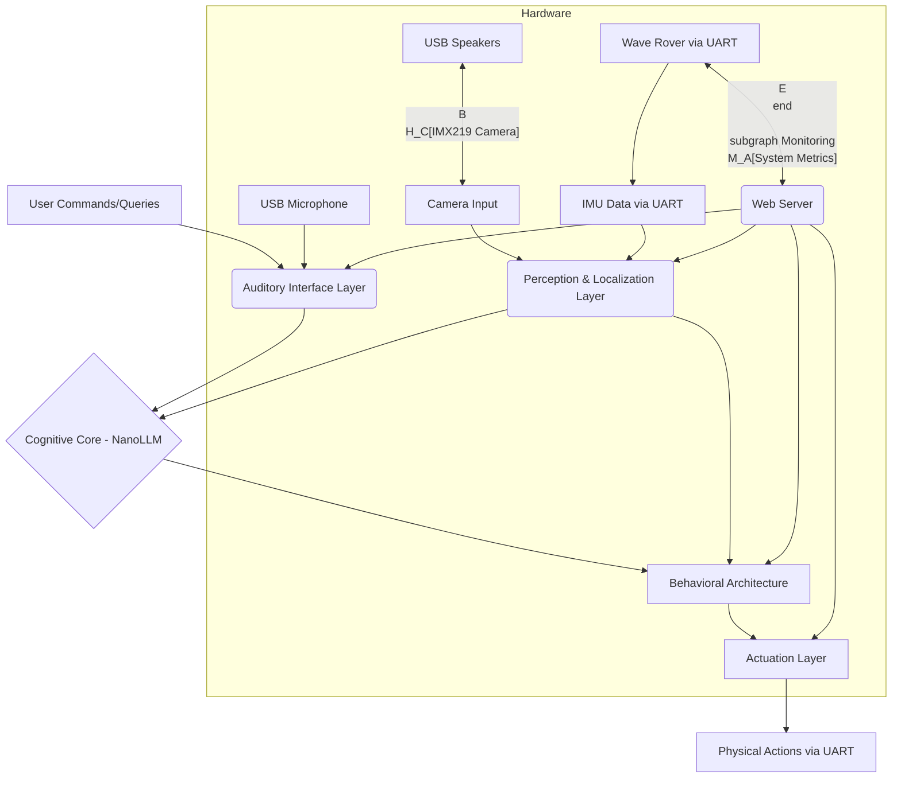

# Architecture Document: Local, Real-Time Autonomous AI Assistant

## 1. Project Goal

The primary objective is to develop a local, real-time, multimodal AI robot assistant capable of understanding and fulfilling natural language commands with a high degree of agency. This assistant will operate entirely on the NVIDIA Jetson Orin Nano Developer Kit, leveraging its edge AI capabilities to ensure low latency, enhanced privacy, and offline autonomy.

### Core Capabilities:
- **Multimodal Interaction**: The robot will "see" via a camera, "hear" through a USB microphone with wake word detection, and "talk" through USB speakers using local TTS.
- **Real-time Perception and Mapping**: Continuous object detection and monocular depth estimation will feed a 3D SLAM system to provide a rich, spatial understanding of the environment.
- **Intelligent Command Understanding**: A small, local Language Model (LLM) will interpret complex natural language commands in the context of the robot's map and visual information.
- **Autonomous Agency**: The robot will possess the business logic to make decisions, plan actions, and handle unexpected situations to fulfill its missions.
- **Local Operation**: All processing will occur on the Jetson Orin Nano, eliminating reliance on cloud services.

## 2. System Architecture

The robot's architecture is designed as a modular, layered system, built upon the Robot Operating System 2 (ROS2) for robust inter-process communication and extensibility.

### 2.1. High-Level Overview

The system consists of six primary layers:
1. **Hardware Abstraction Layer**: Direct interfaces with physical sensors (camera, IMU via UART) and actuators (motors via UART, USB audio devices).
2. **Perception & Localization Layer**: Processes raw sensor data into meaningful environmental understanding (object detection, depth estimation, SLAM, and pose estimation).
3. **Auditory Interface Layer**: Handles all human-robot voice interaction via USB audio devices with local wake word detection, ASR, and TTS models.
4. **Cognitive Core**: Provides high-level reasoning and command interpretation using a local Language Model (LLM).
5. **Behavioral Architecture (Business Logic)**: Orchestrates robot actions, decision-making, and mission management using Behavior Trees.
6. **Actuation Layer**: Translates high-level commands into low-level motor controls via UART JSON commands.



### 2.2. ROS2 as the Backbone

ROS2 serves as the foundational middleware:
- **Nodes**: Each functional component will be implemented as a separate ROS2 node
- **Topics**: Data streams communicated via ROS2 topics
- **Services/Actions**: High-level commands handled via ROS2 services or actions
- **Parameter Server**: Dynamic configuration of nodes

### 2.3. Perception & Localization Layer

This layer provides environmental understanding and localization.

#### Camera Interface & Calibration
- **ROS2 Camera Node**: Interfaces with the **IMX219 160° FOV MIPI CSI-2 camera** to publish raw video frames
- **Calibration**: Offline calibration using OpenCV or NVIDIA VPI with checkerboard pattern to generate intrinsic parameters and fisheye distortion coefficients
- **Undistortion Node**: Subscribes to raw images, applies undistortion transform, publishes corrected images for downstream tasks

#### IMU and Odometry Fusion
- **UART IMU Node**: New node that communicates with Wave Rover via UART (JSON command `{"T":126}`) to retrieve IMU data including:
  - Heading angle
  - Geomagnetic field
  - Acceleration
  - Attitudes (roll, pitch, yaw)
  - Temperature
- **Data Publishing**: Parses JSON responses and publishes to `/imu/data` topic in `sensor_msgs/Imu` format
- **Odometry Estimation**: Since Wave Rover motors lack encoders, odometry will be estimated from:
  - IMU integration for orientation
  - Dead reckoning from commanded velocities (with high uncertainty)
  - Visual odometry from SLAM as primary source
- **Sensor Fusion**: The `robot_localization` package (EKF) will fuse:
  - IMU data (orientation, angular velocity)
  - Visual odometry from RTAB-Map
  - Commanded velocity estimates (with appropriate covariance)

#### Real-time Object Detection
- **YOLO Model**: Lightweight YOLO optimized with TensorRT running on GPU
- **Output**: Bounding boxes and class labels published to ROS2 topic

#### Monocular Depth Estimation
- **Model**: **FastDepth** or RT-MonoDepth converted to TensorRT engine
- **Input**: Undistorted color images
- **Output**: Per-pixel depth maps

#### Simultaneous Localization and Mapping (SLAM)
- **Point Cloud Generation**: Back-project depth maps using calibrated camera intrinsics
- **SLAM System**: **RTAB-Map** (Real-Time Appearance-Based Mapping)
  - Primary odometry source for robot localization (no encoder dependency)
  - Generates 3D map with semantic landmarks from YOLO detections
- **Output**: 3D map and continuous robot pose

### 2.4. Auditory Interface Layer

This layer handles all voice interaction using local models and USB audio hardware.

#### Hardware Components
- **USB Microphone**: Standard USB microphone for audio input
- **USB Speakers**: Standard USB speakers for audio output
- Both devices connect to separate USB ports on the Jetson

#### Audio Processing Pipeline

##### Input Pipeline (Speech Recognition)
1. **Audio Capture Node** (`audio_capture_node.py`)
   - Uses PyAudio or ALSA to capture audio from USB microphone
   - Publishes raw audio stream to `/audio/raw` topic
   - Implements circular buffer for continuous audio monitoring

2. **Wake Word Detection Node** (`wake_word_detector_node.py`)
   - Subscribes to `/audio/raw`
   - Runs lightweight wake word detection model (e.g., **Porcupine** or **Mycroft Precise**)
   - Alternative: **openWakeWord** - open-source, runs efficiently on edge devices
   - When wake word detected, publishes trigger to `/audio/wake_word_detected`
   - Continues monitoring in background

3. **Speech-to-Text Node** (`stt_node.py`)
   - Activated by wake word detection
   - Captures audio segment (with VAD - Voice Activity Detection)
   - Runs local ASR model:
     - **Primary Option**: **Whisper Tiny/Base** (OpenAI) - quantized with TensorRT or ONNX
     - **Alternative**: **Vosk** - lightweight, offline ASR with good accuracy
   - Transcribes speech to text
   - Publishes transcribed text to `/audio/transcribed_text`
   - Returns to idle state after silence detected

##### Output Pipeline (Speech Synthesis)
1. **Text-to-Speech Node** (`tts_node.py`)
   - Subscribes to `/audio/tts_request` topic (text messages from Cognitive Core or Behavioral Architecture)
   - Runs local TTS model:
     - **Primary Option**: **Piper** - fast, high-quality neural TTS designed for edge devices
     - **Alternative**: **Coqui TTS** (lightweight models) - open-source, good voice quality
   - Synthesizes speech audio from text
   - Publishes audio to `/audio/tts_output`

2. **Audio Playback Node** (`audio_playback_node.py`)
   - Subscribes to `/audio/tts_output`
   - Uses PyAudio or ALSA to play audio through USB speakers
   - Manages audio queue and playback state

#### Auditory Layer State Machine
```
[Listening for Wake Word] 
    ↓ (wake word detected)
[Recording Command] 
    ↓ (silence detected / timeout)
[Processing Speech → Text]
    ↓
[Command sent to Cognitive Core]
    ↓
[Response generated]
    ↓
[Text → Speech Synthesis]
    ↓
[Audio Playback]
    ↓
[Return to Listening for Wake Word]
```

#### Resource Optimization
- Wake word detection runs continuously but uses minimal resources (~5-10% CPU)
- ASR and TTS models loaded on-demand or kept in memory if sufficient RAM
- Use INT8 quantization for all audio models
- Consider model switching based on available resources

### 2.5. Cognitive Core (Language Model)

The cognitive core provides language-based reasoning.

#### Model Selection
- Quantized LLM of **~2-7 billion parameters** using **NVIDIA NanoLLM**
- Candidates: **LLaMA-2 7B**, **Gemma 2-7B**, or **StableLM**
- INT8/INT4 quantization to fit within 8GB memory budget

#### Input
- Transcribed text from `/audio/transcribed_text`
- Structured world state from Behavioral Architecture:
  - Robot's current pose
  - Semantic map (objects and coordinates from RTAB-Map)
  - Mission status
  - Recent IMU readings (orientation, movement state)

#### Output
- Structured intent (JSON format) to Behavioral Architecture
  - Example: `{"action": "navigate", "target": "red_ball", "coordinates": [x, y, z]}`
- Natural language response text to `/audio/tts_request`

#### Strategic Activation
- Invoked only when complex language understanding required
- Simple commands handled directly by Behavioral Architecture

### 2.6. Behavioral Architecture (Business Logic)

The primary decision-making engine using Behavior Trees.

#### Framework
- **BehaviorTree.CPP** integrated with ROS2

#### Interaction
- Receives robot pose and map data from Perception & Localization Layer
- Processes simple commands from Auditory Layer
- Processes complex intents from Cognitive Core
- Dispatches action goals to Actuation Layer
- Manages dialogue state and TTS requests

#### World Model
- Blackboard contains:
  - Robot state (pose, orientation from IMU)
  - Semantic map of objects and locations
  - Current mission and goals
  - IMU-derived motion state (moving, stationary, stuck detection)

#### Behavior Tree Enhancements
- **Stuck Detection**: Uses IMU accelerometer data to detect if commanded motion is not occurring
- **Dialogue Management**: Coordinates with TTS for status updates and clarification questions
- **Command Parsing**: Handles simple direct commands without invoking LLM

### 2.7. Actuation Layer

Translates decisions into physical movement via UART communication.

#### UART Communication Node (`uart_motor_controller_node.py`)

##### Connection
- Communicates with Wave Rover ESP32 via UART interface
- Default baud rate: 115200 (verify with Wave Rover documentation)
- Serial device: `/dev/ttyTHS0` or `/dev/ttyUSB0`

##### Command Interface
Implements JSON command protocol:

1. **Movement Control** (Primary method)
   ```json
   {"T":1, "L":0.5, "R":0.5}
   ```
   - L: Left wheel speed (-0.5 to +0.5)
   - R: Right wheel speed (-0.5 to +0.5)
   - Values represent PWM percentage (0.5 = 100%, 0.25 = 50%)

2. **ROS-Style Control** (Not available without encoders)
   ```json
   {"T":13, "X":0.1, "Z":0.3}
   ```
   - Note: Only for UGV01 with encoders - NOT applicable for Wave Rover

3. **IMU Data Retrieval**
   ```json
   {"T":126}
   ```
   - Returns IMU data (handled by separate IMU node)

4. **Continuous Feedback** (Recommended)
   ```json
   {"T":131, "cmd":1}
   ```
   - Enables continuous chassis information feedback
   - Suitable for ROS system integration

5. **OLED Display Control** (Optional)
   ```json
   {"T":3, "lineNum":0, "Text":"Status: Active"}
   ```
   - Display robot status on Wave Rover's OLED screen

##### ROS2 Integration
- **Subscribed Topics**:
  - `/cmd_vel` (geometry_msgs/Twist) - converts to wheel speeds
  - `/motor_command` (custom msg) - direct wheel speed commands
- **Published Topics**:
  - `/motor_status` - feedback from continuous mode
  - `/chassis_state` - parsed chassis information

##### Motor Control Logic
- **Differential Drive Kinematics**: Converts linear (v) and angular (ω) velocities to left/right wheel speeds
  ```
  L_speed = (v - ω * wheelbase/2) / max_speed
  R_speed = (v + ω * wheelbase/2) / max_speed
  ```
- **Dead Reckoning**: Publishes rough odometry estimate to `/odom_raw` (low confidence)
- **Command Rate Limiting**: Ensures commands sent at appropriate rate (10-20 Hz recommended)

##### Safety Features
- Watchdog timer: Stops motors if no command received within timeout
- Emergency stop service
- Speed limiting and acceleration profiling

## 3. Monitoring and User Interface

A lightweight web server for real-time monitoring and debugging.

### 3.1. Web Server Architecture
- **Backend**: Flask or FastAPI with WebSocket support
- **Data Flow**: ROS2 bridge node pushes data to web server via WebSockets

### 3.2. Data to Monitor
- **Perception Data**: Live undistorted camera feed, object detection overlays
- **Localization & Map**: RTAB-Map visualization, robot pose, navigation path
- **IMU Data**: Real-time orientation, acceleration, heading
- **Audio Status**: Wake word detection state, ASR/TTS activity
- **Robot State**: Mission status, battery level (if available via UART)
- **AI Model Status**: LLM activity, inference times
- **System Metrics**: CPU/GPU utilization, RAM usage, temperature

### 3.3. Web Server Considerations
- Lightweight implementation to minimize RAM usage
- Optional: Can be disabled during autonomous operation

## 4. Tech Stack

### 4.1. Hardware
- **Main Compute**: NVIDIA Jetson Orin Nano Developer Kit (8GB)
- **Robot Platform**: **Wave Rover robot chassis** with 9-axis IMU (accessible via UART)
- **Perception Sensors**:
  - **Camera**: IMX219 8MP MIPI CSI-2 camera with 160° fisheye lens
- **Audio Peripherals**:
  - **Input**: USB Microphone
  - **Output**: USB Speakers
- **Communication**: UART connection to Wave Rover (baud rate: 115200)
- **Storage**: NVMe SSD (highly recommended)

### 4.2. Software & Frameworks
- **Operating System**: Ubuntu (NVIDIA JetPack SDK)
- **Robotics Middleware**: ROS2 (Humble or newer)
- **Deep Learning Frameworks**: PyTorch, NVIDIA JetPack (CUDA, cuDNN, TensorRT)

#### AI Models & Libraries
- **Object Detection**: Ultralytics YOLO (TensorRT optimized)
- **Monocular Depth**: **FastDepth** or RT-MonoDepth (TensorRT)
- **Localization/Mapping**: **`robot_localization` (EKF)**, **`rtabmap_ros`**
- **Camera Processing**: **OpenCV** or **NVIDIA VPI** (fisheye calibration)
- **Language Model**: **NVIDIA NanoLLM** with quantized **LLaMA-2/Gemma** (~2-7B)

#### Audio Models & Libraries
- **Wake Word Detection**: 
  - **openWakeWord** (recommended) - open-source, lightweight
  - Alternative: **Porcupine** (free tier available)
- **Speech-to-Text**: 
  - **Whisper Tiny/Base** (OpenAI) - TensorRT optimized
  - Alternative: **Vosk** - lightweight offline ASR
- **Text-to-Speech**: 
  - **Piper** (recommended) - fast neural TTS for edge
  - Alternative: **Coqui TTS** (lightweight models)
- **Audio I/O**: **PyAudio** or **python-sounddevice**
- **VAD**: **webrtcvad** or **silero-vad**

#### Other Libraries
- **Serial Communication**: **pySerial** (UART to Wave Rover)
- **Behavior Tree**: **BehaviorTree.CPP**
- **Web Server**: Flask/FastAPI with WebSocket support

### 4.3. Programming Languages
- **Primary**: Python (most ROS2 nodes)
- **Secondary**: C++ (performance-critical nodes, BehaviorTree.CPP)
- **Frontend**: HTML, CSS, JavaScript

## 5. Development Style and Best Practices

### 5.1. Modular and Component-Based Design
- Encapsulate functionality in distinct ROS2 nodes with well-defined interfaces
- Each audio processing stage is a separate node for modularity

### 5.2. Performance Optimization
- **Image Pre-processing**: Always apply fisheye undistortion before AI processing
- **TensorRT**: Use FP16/INT8 quantization for all vision models
- **Audio Model Quantization**: INT8 quantization for Whisper, optimized models for TTS
- **LLM Quantization**: INT8/INT4 via NanoLLM
- **Headless Operation**: Run Jetson headless to maximize RAM
- **Swap File**: Configure large swap on NVMe SSD
- **Model Loading**: Consider lazy loading for ASR/TTS if RAM constrained

### 5.3. Robustness and Error Handling
- **UART Communication**: Implement retry logic and error handling for JSON commands
- **Audio Pipeline**: Handle USB device disconnection/reconnection gracefully
- **Behavior Trees**: Robust fallbacks for stuck detection and recovery
- **IMU Integration**: Validate IMU data and handle communication failures
- **Comprehensive Logging**: Debug logs for all subsystems

### 5.4. Development Workflow
- Use Docker for containerization
- Git for version control
- ROS2 simulation tools (Gazebo) for initial testing
- Hardware-in-the-loop testing with actual Wave Rover and audio devices

## 6. Extra Details for an AI Coding Agent

### 6.1. Maintaining Context and State
- **Behavior Tree Blackboard**: Central repository for shared state
  - Robot pose and orientation (from SLAM + IMU fusion)
  - Semantic map from RTAB-Map
  - IMU-derived motion state
  - Audio system state (listening/processing/speaking)
  - Current mission and goals
- **LLM Context**: Text-based context derived from Blackboard, not raw sensors

### 6.2. Implementation Directives

#### Critical Pipeline Steps
1. **Camera**: Raw image → Undistortion → YOLO/Depth/SLAM
2. **Audio Input**: USB Mic → Wake Word → ASR → Transcribed Text → Cognitive Core
3. **Audio Output**: Cognitive Core → TTS Request → TTS Synthesis → USB Speakers
4. **IMU**: UART Query → JSON Parse → `/imu/data` topic → EKF Fusion
5. **Motor Control**: Behavior Tree → Twist msg → Differential Drive → UART JSON → Wave Rover

#### Model Deployment
- **Vision**: PyTorch/ONNX → TensorRT Engine
- **Language**: HuggingFace → Quantized Model via NanoLLM
- **Audio**: 
  - Wake Word: Pre-trained model (openWakeWord/Porcupine)
  - ASR: Whisper → TensorRT/ONNX optimization
  - TTS: Piper (pre-optimized) or Coqui → ONNX

#### UART Communication
- Initialize serial connection on node startup
- Enable continuous feedback mode: `{"T":131, "cmd":1}`
- Poll IMU at 10-20 Hz: `{"T":126}`
- Send motor commands at 10-20 Hz
- Implement JSON parser for responses
- Handle malformed JSON gracefully

#### Audio Processing
- Wake word detector runs in separate thread/process
- ASR activated only after wake word (reduces CPU load)
- TTS synthesis can be async (queue-based)
- Implement audio device health monitoring

### 6.3. Project Structure

```
robot_assistant_project/
├── src/
│   ├── perception_nodes/
│   │   └── perception_nodes/
│   │       ├── camera_driver.py
│   │       ├── image_undistort_node.py
│   │       ├── object_detector.py
│   │       └── depth_estimator.py
│   ├── localization_nodes/
│   │   ├── launch/
│   │   │   └── localization_launch.py
│   │   └── src/
│   │       ├── uart_imu_node.py          # NEW: Retrieves IMU via UART
│   │       └── slam_node.py
│   ├── audio_interface_nodes/            # REVISED PACKAGE
│   │   └── audio_interface_nodes/
│   │       ├── audio_capture_node.py     # USB mic capture
│   │       ├── wake_word_detector_node.py # Wake word detection
│   │       ├── stt_node.py               # Speech-to-Text
│   │       ├── tts_node.py               # Text-to-Speech
│   │       └── audio_playback_node.py    # USB speaker playback
│   ├── cognitive_core_node/
│   │   └── cognitive_core_node/
│   │       └── nanollm_interface.py
│   ├── behavioral_nodes/
│   │   └── behavioral_nodes/
│   │       ├── behavior_tree_executor.py
│   │       └── dialogue_manager.py       # NEW: Coordinates conversations
│   ├── actuation_nodes/                  # REVISED PACKAGE
│   │   └── actuation_nodes/
│   │       └── uart_motor_controller.py  # UART JSON motor control
│   └── web_interface_nodes/
│       └── web_interface_nodes/
│           └── web_server.py
├── config/
│   ├── camera_calibration.yaml
│   ├── localization_config.yaml
│   ├── audio_config.yaml                 # NEW: Audio device configs
│   ├── uart_config.yaml                  # NEW: UART port and baud rate
│   └── behavior_tree_config.xml
├── models/
│   ├── wake_word/                        # NEW: Wake word model files
│   ├── whisper_tiny_trt/                 # NEW: Optimized ASR
│   ├── piper_voice/                      # NEW: TTS voice files
│   ├── yolo_trt/
│   ├── depth_trt/
│   └── nanollm_quantized/
└── launch/
    ├── full_system_launch.py
    ├── perception_launch.py
    ├── audio_pipeline_launch.py          # NEW: All audio nodes
    └── actuation_launch.py
```

### 6.4. Resource Budget Estimates (8GB RAM)

- **System/ROS2**: ~1.5 GB
- **RTAB-Map SLAM**: ~1.5 GB
- **YOLO + Depth Models**: ~1.0 GB
- **NanoLLM (7B quantized)**: ~2.5 GB
- **Audio Models** (Wake Word + Whisper Tiny + Piper): ~500 MB
- **Web Server + Monitoring**: ~300 MB
- **Buffers/Other**: ~700 MB

**Total**: ~8.0 GB (tight but feasible with optimization)

**Optimization Strategies**:
- Lazy load LLM (load only when needed for complex reasoning)
- Use Whisper Tiny (not Base) for ASR
- Implement model unloading for non-critical periods
- Large swap file on NVMe for overflow

## 7. Key Architectural Decisions & Rationale

### 7.1. USB Audio vs. Integrated Module
**Decision**: Use USB microphone/speakers with local models instead of Yahboom module.
**Rationale**: 
- Greater flexibility in model selection
- Better quality audio models available
- More control over the pipeline
- Easier debugging and monitoring

### 7.2. UART Communication for Wave Rover
**Decision**: JSON-based UART commands for motor control and IMU data.
**Rationale**:
- Wave Rover motors lack encoders (no ROS CMD_ROS_CTRL available)
- Direct PWM control via CMD_SPEED_CTRL provides precise control
- UART IMU access provides critical orientation data for navigation
- Continuous feedback mode optimizes for ROS integration

### 7.3. Visual Odometry as Primary
**Decision**: Rely on RTAB-Map visual odometry instead of wheel encoders.
**Rationale**:
- Wave Rover motors have no encoders
- Visual SLAM provides more accurate positioning
- IMU provides complementary orientation data
- Dead reckoning from commanded speeds used only as rough estimate

### 7.4. Modular Audio Pipeline
**Decision**: Separate nodes for wake word, ASR, TTS, and playback.
**Rationale**:
- Independent optimization of each stage
- Wake word runs continuously with minimal overhead
- ASR/TTS activated only when needed
- Easy to swap models or add features

## 8. Testing and Validation Strategy

### 8.1. Component Testing
- **UART Communication**: Test JSON command parsing and IMU data retrieval in isolation
- **Audio Pipeline**: Test each node independently with recorded audio
- **Motor Control**: Verify differential drive kinematics with stationary tests
- **IMU Integration**: Validate orientation data against ground truth

### 8.2. Integration Testing
- **Audio→Cognitive→Motor**: Full voice command execution
- **Perception→Navigation**: Object detection and navigation
- **IMU→Localization**: Fusion accuracy under motion

### 8.3. Performance Benchmarks
- Audio latency (wake word detection → TTS playback)
- Vision processing frame rate
- LLM inference time
- UART communication latency
- Overall RAM usage under full load

## References
- **automaticaddison.com**: IMU and wheel odometry fusion with `robot_localization`
- **forums.developer.nvidia.com**: Jetson Orin Nano model optimization and camera calibration
- **jetson-ai-lab.com**: NVIDIA NanoLLM documentation
- **dusty-nv.github.io**: Jetson AI tools and examples
- **introlab.github.io**: RTAB-Map SLAM documentation
- **openai.com/research**: Whisper speech recognition
- **github.com/rhasspy/piper**: Piper TTS for edge devices
- **github.com/dscripka/openWakeWord**: Open-source wake word detection
- **pyserial.readthedocs.io**: Python serial communication library