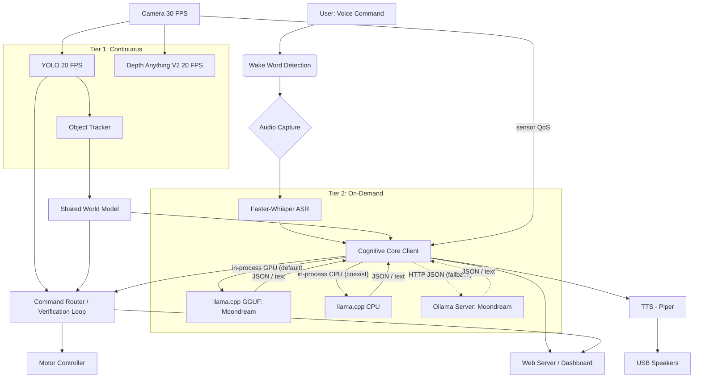

# Architecture Document: Local, Real-Time Autonomous AI Assistant
## Version 4.1 - Moondream VLM + Whisper, no-SLAM MVP

> **v4.1 scope note (25 Sep 2026).** SLAM / localization is **out of scope for the
> MVP** and has been removed from this document. The robot uses a **reactive
> "go to visible object"** behavior built on the existing Tier 1 YOLO + depth
> output (and the visual-verification loop), with **no map and no RTAB-Map
> dependency**. Revisit SLAM only if persistent multi-room memory becomes a real
> requirement.
>
> v4.1 changes vs 4.0: the in-process `llama.cpp` backend is the promoted default
> (Ollama remains an automatic fallback) and now has a **CPU coexistence mode** for
> the 8 GB Orin (§2.5.1); a `visual_verification_node` with a dedicated boolean
> system prompt; a monitoring web server with a dashboard (`/api/subsystems`,
> `/api/resources`); TensorRT 10 (`execute_async_v3`) depth inference; sensor-QoS
> image delivery; and a reusable full-system soak harness. Verified 60-minute soak
> numbers are recorded in `STATUS.md`.

## 1. Project Goal

The primary objective is to develop a local, real-time, multimodal AI robot assistant capable of understanding and fulfilling natural language commands with a high degree of agency. This assistant will operate entirely on the NVIDIA Jetson Orin Nano Developer Kit, leveraging a split-cognitive architecture to ensure low latency for navigation and robust reasoning for complex tasks.

### Core Capabilities:
- **Modular Multimodal Interaction**: The robot "hears" via **faster-whisper** (ASR), "sees" via camera, and reasons using **Moondream** (1.6B VLM) run **in-process via `llama.cpp`** (GPU by default; CPU coexistence mode on the 8 GB Orin), with **Ollama** as an automatic fallback.
- **Two-Tier Real-Time Perception**: Continuous low-level perception (YOLO, depth estimation) runs at 20-30 FPS for reactive navigation, while strategic high-level reasoning operates on-demand.
- **In-process (or client-server) Cognitive Core**: The robot application runs the efficient Moondream 1.6B model in-process for scene understanding and visual goal verification; it can also act as a client to a local Ollama instance.
- **Autonomous Agency**: The robot possesses the business logic to make decisions, plan actions, handle unexpected situations, and verify task completion autonomously.
- **Local Operation**: All processing occurs on the Jetson Orin Nano, eliminating reliance on cloud services.

## 2. System Architecture

The robot's architecture is designed as a modular, layered system built upon Robot Operating System 2 (ROS2). Heavy cognitive lifting runs in-process by default, with a local model server (Ollama) as a fallback.

### 2.1. High-Level Overview

The system consists of six primary layers:

1. **Hardware Abstraction Layer**: Direct interfaces with physical sensors and actuators.

2. **Tier 1 - Continuous Perception Layer**: Real-time processing at 20-30 FPS.
   - Object detection (YOLO)
   - Depth estimation (Depth Anything V2 Small)
   - Object tracking

3. **Auditory Interface Layer**:
   - Wake word detection (always-on)
   - **Speech-to-Text (ASR)**: Uses `faster-whisper` to convert audio to text.
   - Text-to-Speech for robot responses.

4. **Tier 2 - Strategic Cognitive Core (in-process `llama.cpp` default / Ollama fallback)**: On-demand reasoning (1-3 second latency on GPU).
   - **VLM**: Moondream (1.6B) run in-process via `llama.cpp` (GPU by default, CPU coexistence mode when the GPU is saturated by perception).
   - **Reasoning Node**: captures the latest camera frame (sensor QoS), constructs prompts with base64 images and transcribed text.
   - Outputs structured intents (GBNF-constrained JSON) and free-text visual verification results.

5. **Behavioral Architecture**: Routes commands (regex + cognitive forward) and runs the visual-verification loop.

6. **Actuation Layer**: Translates high-level commands into low-level motor controls.

7. **Monitoring Layer**: A FastAPI web server exposes health, per-subsystem status (with staleness), host resources/thermals, and an HTML dashboard.



### 2.2. ROS2 as the Backbone

ROS2 remains the middleware for communication between all system components.

#### Running ROS2 Nodes with Virtual Environment

**Important**: This project uses a Python virtual environment (`.venv`) for package isolation, but ROS2 `colcon build` creates executables with system Python shebangs. To run nodes properly:

**Use the provided launcher script**:
```bash
# Launch any ROS2 Python node
./launch_node.sh <package_name> <node_name>

# Example: Start audio capture
./launch_node.sh audio_interface_nodes audio_capture_node
```

**For ROS2 commands and topic monitoring**:
```bash
# Source the combined environment
source ros2_venv.sh

# Now use any ROS2 command
ros2 topic list
ros2 topic hz /audio/raw
ros2 node list
```

**Why these tools exist**:
- `launch_node.sh`: Runs ROS2 Python nodes using the venv Python interpreter (bypasses system Python shebang)
- `ros2_venv.sh`: Sources both venv and ROS2, adds venv packages to PYTHONPATH for ROS2 CLI tools
- This approach maintains Python package isolation while ensuring ROS2 functionality

**Standard workflow** (multiple terminals):
```bash
# Terminal 1 - Run a node
./launch_node.sh audio_interface_nodes audio_capture_node

# Terminal 2 - Monitor topics
source ros2_venv.sh
ros2 topic hz /audio/raw

# Terminal 3 - Run tests
source ros2_venv.sh
python manual_tests/test_audio_capture_playback.py
```

### 2.3. Tier 1: Continuous Perception Layer
(Unchanged from v3.0 - YOLO and Depth operate independently of the LLM/VLM.
Localization/SLAM is out of scope for the MVP; see the v4.1 scope note above.)

### 2.4. Auditory Interface Layer (Revised - Self-Contained Pipeline)

This layer uses a **self-contained audio processing pipeline** that handles all audio input processing locally within a single node, publishing only lightweight control messages.

#### Hardware Components
- **USB Microphone** & **USB Speakers** (Separate USB ports)

#### Audio Processing Pipeline

**1. Audio Capture & Processing Node** (`audio_capture_node.py`) - **SELF-CONTAINED PIPELINE**
   - **Audio Capture**: Captures raw audio via `arecord` subprocess (no ROS2 audio streaming).
   - **Circular Buffer**: Maintains 5-second rolling buffer for pre-roll capture.
   - **Wake Word Detection**:
     - Uses **openWakeWord** (ONNX) from https://github.com/dscripka/openWakeWord.
     - Model: Pre-trained `hey_roe_ver.onnx` included in the repository.
     - Runs continuously on every audio chunk.
     - Publishes wake word detection events to `/audio/events`.
     - **Custom Model Training**: openWakeWord provides automated utilities for training custom models:
       - **Quick Training**: Google Colab notebook with easy interface (<1 hour, no dev experience needed)
       - **Advanced Training**: Detailed notebook with full customization (higher quality, requires dev experience)
   - **Voice Activity Detection (VAD)**:
     - Uses **Silero VAD** (ONNX) via `silero-vad` package.
     - Activates after wake word detection.
     - Detects speech start/end boundaries.
     - Publishes speech events to `/audio/events`.
   - **Automatic Speech Recognition (ASR)**:
     - **Model**: `faster-whisper` (CTranslate2 backend).
     - **Size**: `tiny.en` or `base.en` (Quantized to INT8).
     - Transcribes audio segment captured by VAD.
     - **Output**: Transcribed text published to `/audio/transcription`.
     - **Performance**: <500ms for typical commands on Jetson Orin.
     - **Memory**: ~400MB RAM.
   - **State Machine**: Manages pipeline flow (IDLE → WAKE_WORD_DETECTED → RECORDING → TRANSCRIBING → IDLE).
   - **Published Topics**:
     - `/audio/events` (AudioEvent): Wake word detections, VAD events
     - `/audio/transcription` (TranscriptionResult): Transcribed text with confidence
   - **No Audio Streaming**: All audio processing happens locally; no raw audio published over ROS2.

**2. Text-to-Speech** (`audio_playback_node.py`, Piper integrated)
   - Uses **Piper** (ONNX), loaded lazily on first request.
   - Subscribes to `/audio/tts_request` and plays notification sounds driven by
     `/audio/events`. The old standalone `tts_node.py` is deprecated.

### 2.5. Tier 2: Cognitive Core (in-process llama.cpp default; Ollama optional)

The strategic reasoning layer is reached through a single bridge abstraction
(`is_available()` / `generate(prompt, image_base64, ...) -> dict`), so the rest
of the system is agnostic to which runtime is used.

#### Backend A — in-process llama.cpp (default)
- **Library**: `llama-cpp-python` built with CUDA (`GGML_CUDA=on`, `CMAKE_CUDA_ARCHITECTURES=87`).
- **Weights**: the same `moondream:latest` GGUF blobs Ollama uses.
- **Vision**: `mtmd` clip encoder GPU-offloaded (`use_gpu=True`); the LLM context
  uses flash attention (`llm_flash_attn:=true`).
- **Flag**: `cognitive_backend:=llamacpp` (default).
- **Status**: promoted (24 Sep 2026) — faster honest vision end-to-end
  (1.92 s vs 2.61 s) and lower RSS than Ollama. See `docs/model_performance.md`.

#### 2.5.1 Choosing the Cognitive Device (CPU vs GPU)

The 8 GB Orin cannot hold Moondream (GPU) and the camera + YOLO + Depth TensorRT
engines in the GPU/nvmap pool at the same time: GPU `llama.cpp` fails to allocate
its context and the Ollama fallback fails with `failed to allocate CUDA0 buffer`.
To run the **whole system concurrently**, the cognitive core has a CPU mode:

- `cognitive_cuda_visible_devices:=none` hides CUDA **from the cognitive process
  only** (per-node `additional_env`, so perception keeps its GPU), and
  `llm_n_gpu_layers:=0` keeps the LLM on CPU. The `mtmd` clip encoder then also
  runs on CPU.
- CPU inference is correct but slow (~20 s per vision query), so
  `cognitive_request_timeout` and `verification_response_timeout` must be raised.
  Use the GPU backend when real-time VLM latency matters and perception can yield
  GPU memory; use CPU mode for concurrent 24/7 operation.

Because VLM inference blocks for seconds, the image subscription lives in its own
callback group and the node runs a `MultiThreadedExecutor`, so camera-frame
caching is never starved by an in-flight inference.

#### Backend B — Ollama HTTP (optional)
- **Software**: **Ollama** (Linux ARM64 version).
- **Service**: Runs as a background service (`systemd`).
- **Model**: `moondream` (~1.6B parameters, 4-bit GGUF).
- **Endpoint**: `http://localhost:11434/api/generate`.
- **Flag**: `cognitive_backend:=ollama`.
- **Fallback**: if the in-process model cannot load (missing blobs /
  `llama-cpp-python`), the node automatically falls back to this backend.

#### Client Node (`cognitive_client_node.py`)

This ROS2 node bridges the robot's state with the active cognitive backend
(in-process `llama.cpp` by default, Ollama fallback).

**Inputs**:
1. **Text**: Transcribed commands from Whisper (`/audio/transcription`).
2. **Vision**: the latest camera frame from `/camera/undistorted` (sensor QoS,
   cached in a dedicated callback group).
3. **Queries**: direct `MultimodalQuery` requests (e.g. from the command router
   or the visual-verification node), which may carry a per-query system prompt.

**Process**:
1. Receives a command or query trigger.
2. Uses the cached frame and encodes it to Base64 (if vision is requested).
3. Constructs the prompt (node system prompt or per-query override).
4. Runs in-process `llama.cpp` (or POSTs to Ollama), blocking in a query callback
   group so image caching continues.
5. Parses the JSON intent (GBNF-constrained on `llama.cpp`) or returns free text.
6. Publishes `MultimodalResponse` and, for intents, `CognitiveCommand`.

**Bridge interface** (`OllamaBridge` and `LlamaCppBridge` are interchangeable):

```python
class CognitiveBridge:
    """Ollama (HTTP) and llama.cpp (in-process) expose the same surface."""
    def is_available(self) -> bool: ...

    def generate(self, prompt, image_base64=None, num_ctx=512,
                 num_predict=128, temperature=0.3, force_json=False) -> dict:
        # returns {"response": str, "model": str, "total_duration": int_ns,
        #          "eval_count": int, "prompt_eval_count": int}
        # or {"error": str} on failure
        ...
```

The JSON intent schema is enforced by the llama.cpp backend with a GBNF
grammar / `response_format={"type": "json_object"}`; `parse_json_intent()` is
kept as a defensive fallback for the Ollama path.

#### Output Formats

**Structured Intent (Parsed from response)**:
```json
{
  "action": "navigate",
  "target": "red ball",
  "explanation": "I see a red ball on the floor to the left."
}
```

#### Performance (measured on-device under MAXN SUPER)
- **GPU (llama.cpp, no concurrent perception)**: vision e2e ~1.9 s; generation
  ~49 tok/s; clip encode ~415 ms.
- **CPU coexistence mode**: vision e2e ~20 s per query (correctness fallback).
- **Full-system soak (perception + audio + behavior + web, no VLM)**: ~5.6 GB
  RAM, 65 °C, 0 crashes over 60 min. See `STATUS.md` for the full table.

(Detailed numbers and the 15 W baseline: `docs/model_performance.md`.)

### 2.6. Behavioral Architecture

No BehaviorTree.CPP for the MVP. A lightweight `command_router_node` keeps the
regex + cognitive-forward pattern, and a `visual_verification_node` closes the
goal-completion loop.

**Logic Flow**:
1. **Simple command?** (regex match on Whisper text) -> execute directly via `/cmd_vel`.
2. **Complex command?** -> cognitive core with the current frame -> parse intent -> execute.
3. **Goal issued** (navigate/search) -> `visual_verification_node` stops, asks the
   cognitive core "is goal X achieved?", and retries with ±45° rotation if unsure.

### 2.7. Actuation Layer
(Unchanged - UART to Wave Rover.)

### 2.8. Monitoring Layer (web interface)

A single `web_interface_nodes` node runs FastAPI/uvicorn in a background thread
while `rclpy` spins on the main thread. It caches lightweight telemetry topics
and serves:

- `GET /health` — liveness probe.
- `GET /status` — combined subsystem + host-resource snapshot (flat keys kept for
  backwards compatibility).
- `GET /api/subsystems` — per-subsystem status with age and a `stale` flag.
- `GET /api/resources` — CPU %, load average, memory, disk and Jetson
  `thermal_zone*` temperatures.
- `GET /` and `/dashboard` — a dependency-free HTML dashboard that polls `/status`.

Cached topics: `/cognitive/status`, `/verification/status`, `/chassis_state`,
`/audio/events`, `/perception/events`, `/perception/obstacles`.

## 3. Operational Flow Examples

### 3.1. Example: "Go to the red ball"

```
T=0.0s: User: "Hey Rover"
        → openWakeWord triggers recording

T=0.1s: User: "Go to the red ball"
        → Audio captured (1.5s)

T=1.6s: Audio Processing
        → Faster-Whisper transcribes: "Go to the red ball"
        → Published to /audio/transcription

T=1.8s: Command Routing
        → Regex check fails (not a simple "stop" command).
        → Routed to Cognitive Client.

T=1.9s: Context Assembly
        → Camera snapshot captured & Base64 encoded.
        → Prompt built: "User said 'Go to the red ball'. Identify target in image."

T=2.0s: Ollama Inference (Moondream)
        → Request sent to localhost:11434
        → Moondream analyzes image.
        → Output: "{"action": "navigate", "target": "red ball", "visual_confirm": true}"

T=3.5s: Inference Complete (1.5s total duration)
        → Client parses JSON.
        → Publishes intent to the command router.

T=3.6s: Execution (reactive, no map/SLAM)
        → Command router turns toward / approaches the visible target.
        → Visual-verification loop confirms arrival (or retries with rotation).
```

### 3.2. Example: Visual Verification ("Am I there?")

```
T=0.0s: Robot reaches coordinate target.
T=0.1s: Visual verification node requests verification.
T=0.2s: Cognitive Client calls the configured backend.
        → Image: Current view.
        → Prompt: "Is there a red ball in the center of this image? Answer Yes/No."
T=1.0s: Moondream responds: "Yes, a red ball is visible."
T=1.1s: Task marked Complete.
```

## 4. Memory Management Strategy

The Jetson Orin Nano has 8GB shared RAM (plus swap). Efficient models
(Whisper/Moondream) are kept resident ("static load"); the GPU/nvmap pool, not
general RAM, is the binding constraint once perception engines are loaded.

### 4.1. Revised RAM Budget

| Component | RAM Usage | Notes |
|-----------|-----------|-------|
| **OS + ROS2 Core** | 1.2 GB | Ubuntu + Middleware |
| **Tier 1 (YOLO + Depth)** | ~1.5 GB | Optimized TensorRT engines + buffers (estimate) |
| **Ollama Service (Idle)** | 0.2 GB | Service overhead |
| **Moondream Model (Loaded)** | 1.8 GB | 4-bit Quantized (keeps resident) |
| **Faster-Whisper** | 0.5 GB | `base.en` INT8 |
| **TTS (Piper)** | 0.2 GB | |
| **Buffers/Overhead** | 1.0 GB | Camera buffers, message queues |
| **TOTAL** | **~6.4 GB** | **Fits in 8GB** (SLAM removed from v3.1 budget) |

> Measured reality: the `ollama` process peaks at **~3.0 GB** with Moondream
> resident (higher than the 2.0 GB service+model estimate above), and idle
> `available` RAM is ~6 GB. A 60-minute full-system soak (perception + audio +
> behavior + web, no VLM) averaged **5.57 GB** with a **5.96 GB** peak and 1.66 GB
> headroom — see `STATUS.md`. The GPU/nvmap pool is exhausted before general RAM,
> which is why Moondream needs CPU mode when perception is resident (§2.5.1).

**Strategy**:
1. The cognitive backend keeps Moondream loaded (`keep_alive=-1` for Ollama) when
   the GPU allows it; otherwise use the CPU coexistence mode.
2. **Faster-Whisper** loads on wake-word / first use (lazy) to save RAM.
3. If RAM pressure hits >95%, reduce camera resolution/buffers before touching the
   cognitive core.
4. Don't load all models at once; GPU memory is the scarce resource on 8 GB.

## 5. Model Optimization Strategy

### 5.1. Vision & Reasoning (Moondream via Ollama)
- **Format**: GGUF (4-bit quantization).
- **Optimization**: Ollama automatically utilizes the Orin Nano GPU (via CUDA/JetPack libraries if configured correctly).
- **Settings**:
  - `num_ctx`: 2048 (Sufficient for image + prompt).
  - `num_predict`: 128 (Prevent long hallucinations).

### 5.2. Speech (Faster-Whisper)
- **Format**: CTranslate2 (INT8).
- **Optimization**: Runs efficiently on CPU or GPU. Given the VLM uses GPU, running Whisper on CPU (4 cores) is acceptable to save VRAM, or strictly limit its GPU memory allocation.

### 5.3. Perception (YOLO/Depth)
- **Format**: TensorRT FP16 (DeepStream).
- **Optimization**: These run on the DLA (Deep Learning Accelerator) if possible, or GPU.

## 6. Tech Stack

### 6.1. Hardware
- **Main Compute**: NVIDIA Jetson Orin Nano (8GB).
- **Robot Platform**: Wave Rover.

### 6.2. Software & Frameworks
- **OS**: Ubuntu 22.04 (JetPack 6.x preferred for newer Ollama support).
- **Middleware**: ROS2 Humble/Iron.
- **LLM Server**: **Ollama** (Linux).
- **ASR**: **faster-whisper** (Python).
- **VLM**: **Moondream** (in-process `llama.cpp` default; Ollama fallback).
- **Vision**: DeepStream / TensorRT.
- **Web**: FastAPI + uvicorn.

## 7. Development Best Practices

### 7.1. Ollama Management
- Create a `systemd` service for Ollama to ensure it starts on boot.
- Use a startup script to "pull" and "preload" the Moondream model so the first command isn't delayed.
  - `curl http://localhost:11434/api/generate -d '{"model": "moondream"}'` (Empty prompt to load weights).

### 7.2. Prompt Engineering
Moondream is small. Prompts must be direct.
- **Bad**: "Please analyze this image and tell me if you can see a ball and where it is."
- **Good**: "Describe this image. JSON output: {'object': 'red ball', 'location': 'center'}."

Two system prompts are used, selected per query via `MultimodalQuery.system_prompt`:
- **Intent prompt** (command routing): asks for the GBNF/JSON intent schema.
- **Verification prompt** (`visual_verification_node`): asks for a single word,
  "Yes or No", and never for JSON — mixing the intent prompt into a verification
  query makes the model produce unusable JSON.

## 8. Safety and Recovery
(Unchanged).

## 9. Testing Strategy

### 9.1. Cognitive Benchmarking
Benchmark Moondream on the Jetson with the scripts in `scripts/testing/llm/`.
- **Metric**: Tokens per second (TPS). Target > 10 TPS.
- **Metric**: Vision Encode Time. Target < 500 ms (GPU).
- **Methodology**: use a **unique frame per run** — Ollama caches the image KV
  prefix, so reusing one frame reports a misleadingly low prompt-eval that does
  not generalize.

### 9.3. Full-System Soak
`scripts/testing/integration/run_soak.sh` runs the actuation-less system plus a
synthetic workload and `tegrastats` for a fixed duration (configurable backend,
CUDA visibility, GPU layers, and per-query timeouts), then collects logs. See
`STATUS.md` for the recorded 60-minute result.

### 9.2. ASR Testing
Test `faster-whisper` with robot motor noise.
- May need to apply noise suppression (WebRTC VAD or RNNoise) before the Whisper step if motor noise is high.

## 10. Project Structure Updates

```
robot_assistant_project/
├── src/
│   ├── cognitive_core_nodes/
│   │   └── cognitive_core_nodes/
│   │       ├── cognitive_client_node.py (NEW - Ollama Bridge)
│   │       └── json_parser.py (NEW)
│   ├── audio_interface_nodes/
│   │   └── audio_interface_nodes/
│   │       ├── asr_node.py (NEW - Faster-Whisper)
│   │       └── ...
...
├── scripts/
│   ├── install_ollama.sh
│   └── pull_moondream.sh
...
```

## 11. Key Architectural Decisions

### 11.1. Moondream over Gemma 3n
**Rationale**: Gemma 3n proved too heavy for the 8GB RAM when combined with YOLO and depth perception. Moondream (1.6B) is significantly smaller, designed specifically for edge VLM tasks, and serves rapidly via Ollama.

### 11.2. Faster-Whisper Integration
**Rationale**: By splitting ASR from the VLM, we gain modularity. Whisper is the industry standard for robust offline ASR. The "Faster" implementation (CTranslate2) is highly optimized for resource-constrained devices.

### 11.3. In-process llama.cpp (default), with Ollama as the optional fallback
**Rationale**: Running Moondream in-process removes the HTTP/JSON/base64 round trip and the separate daemon, and with flash attention plus GPU `mtmd` vision it is the fastest honest vision path on the Orin (1.92 s vs 2.61 s) with lower RSS. The Ollama HTTP path is retained as an automatic fallback and for easier model swapping (e.g., trying `llava-phi3` or `tiny-llava`) without changing code; `cognitive_backend:=ollama` selects it.

### 11.4. Per-process CUDA visibility for VLM/perception coexistence
**Rationale**: On 8 GB the GPU/nvmap pool cannot hold Moondream and the perception
engines together. Rather than forcing a global CPU/GPU choice, CUDA visibility is
scoped to the cognitive process (`additional_env`) so the operator can run the VLM
on CPU while perception keeps the GPU. A global `SetEnvironmentVariable` was tried
first and correctly rejected — it blinded `pycuda`/TensorRT in the perception
nodes.

## 12. Implementation Roadmap (Adjusted)

### Phase 3: Audio Pipeline (Weeks 5-6)
- Implement `faster-whisper` node.
- Validate transcription accuracy with motor noise.

### Phase 4: Cognitive Core (Weeks 7-9)
- Install Ollama on Jetson Orin Nano.
- Pull and quantize/verify `moondream`.
- Develop `cognitive_client_node.py`.
- Optimize prompts for JSON output.


### Phase 5: Behavioral Architecture (Weeks 10-12)

> **As built (v4.1)**: BehaviorTree.CPP was **not** adopted. The command router
> (regex + cognitive forward) plus a dedicated `visual_verification_node` cover
> this phase. The original BT framing is retained only for context.

**Goals**: Integrate the asynchronous cognitive client with reactive command routing.

**Tasks**:
1.  **JSON Intent Parser**: retained in `cognitive_client_node.py` (markdown-fence stripping + validation), with a GBNF / `response_format` JSON path on the llama.cpp backend.
2.  **Async handling**: queries run off the executor callback (in-process llama.cpp) or over a keep-alive HTTP session (Ollama) — no blocking behavior-tree tick.
3.  **Visual Verification Logic** (`visual_verification_node.py`):
    - Stops the robot.
    - Asks the cognitive core: *"Is the goal [X] achieved in this image?"*
    - Retries with ±45° rotation if unsure, up to `max_attempts`.

**Deliverables**:
- `command_router_node.py` + `visual_verification_node.py`.
- Robust error/timeout handling for the cognitive backend.

### Phase 6: Integration & Testing (Weeks 13-14)

**Goals**: Full system integration and validation of the Client-Server latency.

**Tasks**:
1.  **Latency Tuning**: Measure the time from "Voice Command" to "Action Start".
    - *Optimization*: Adjust `faster-whisper` beam size (reduce to 1 for speed).
    - *Optimization*: Pre-warm the Moondream model on boot.
2.  **Memory Stress Test**: Run YOLO + Depth + Ollama inference simultaneously. Monitor swap usage.
3.  **Real-world Scenarios**: Test specific prompts like "Find the bottle" to see if Moondream (1.6B) has sufficient semantic knowledge compared to larger models.

**Deliverables**:
- System configuration file optimized for 8GB RAM.
- Benchmark report comparing "Cold Start" vs "Warm" inference times.

### Phase 7: Optional Enhancements (Post-MVP)

**Goals**: Advanced features leveraging the modularity of Ollama.

**Tasks**:
1.  **Model Swapping**: Create a script to dynamically swap models via the Ollama API (e.g., unload `moondream` and load `llama3-chatqa` for text-only queries if high-resolution reasoning is needed).
2.  **Context History**: Implement a sliding window of previous conversation turns in the `cognitive_client_node` to give Moondream "short-term memory."

## 13. Performance Targets Summary (Revised for v4.1)

### Tier 1 - Continuous Perception
| Metric | Target | Current (full soak) | Notes |
|--------|--------|---------------------|-------|
| YOLO Detection | 20+ FPS | 8–10 FPS | DeepStream / TensorRT, CPU undistort |
| Depth Anything V2 | 20+ FPS | ~8.6 FPS (model) | TensorRT FP16, `execute_async_v3` |

### Tier 2 - Strategic Reasoning (llama.cpp + Whisper)
| Metric | Target | Current | Notes |
|--------|--------|---------|-------|
| ASR Transcription | < 0.5s | TBD | Faster-Whisper (`tiny.en`) |
| VLM Inference (GPU) | 15–20 tok/s | ~55 tok/s | Moondream, llama.cpp + flash attn |
| VLM total (GPU) | < 2.5s | ~1.9s | vision end-to-end, no concurrent perception |
| VLM total (CPU coexist) | — | ~20s | correctness fallback when GPU is full |
| VLM Context | 2048 tokens | 2048 | image (~729) + prompt |

### End-to-End System
| Metric | Target | Current | Notes |
|--------|--------|---------|-------|
| Peak RAM Usage | < 7.5 GB | 5.96 GB | 60-min soak (no VLM) |
| Thermal Stability | < 80°C | 65.5°C | max `tj`, 60-min soak |
| Soak stability | 0 crashes | 0 | 60 min, no leak |

## 14. Future Enhancements

### Short-Term (Post-MVP)
- **Dynamic Quantization**: Experiment with different quantization levels of Moondream (q4_k vs q5_k) in Ollama to find the sweet spot between accuracy and speed.
- **Voice Activity Detection (VAD) Tuning**: Integrate `silero-vad` before Whisper to ensure we only transcribe actual speech, saving CPU cycles.

### Medium-Term
- **Upgrade to LLaVA-Phi-3**: If memory allows (or if newer, smaller versions release), replace Moondream with LLaVA-Phi-3 (3.8B) for significantly better reasoning, though this may require pausing continuous perception during inference.
- **Spearker Identification**: Use `pyannote-audio` (if resources permit) to identify *who* is giving commands.

### Long-Term
- **RAG Integration**: Use Ollama's embedding capabilities to allow the robot to "read" a manual or map definition file to better understand context about its environment.

## 15. Known Limitations & Mitigations

### 15.1. Moondream Model Size (1.6B)
**Limitation**: Moondream is a "Tiny" VLM. It has excellent object recognition but poor "world knowledge" and complex reasoning capabilities compared to Gemma 3n (5B) or GPT-4o.
**Mitigation**:
- **Prompt Engineering**: Use very strict, simple system prompts. Do not ask for complex analysis. Ask for "Identification" and "Location".
- **Verification Loop**: If the robot is unsure, program it to rotate 45 degrees and ask again (ensemble the results).

### 15.2. HTTP Overhead
**Limitation**: Using HTTP requests (Ollama) adds slight latency (10-50ms) compared to direct in-memory function calls.
**Mitigation**: Use `requests.Session()` in Python to keep the TCP connection open (Keep-Alive), minimizing handshake overhead.

### 15.3. ASR Errors
**Limitation**: `faster-whisper` (tiny/base) may struggle with unique words or heavy motor noise.
**Mitigation**:
- **Prompting Whisper**: Pass a list of "initial_prompt" keywords to Whisper (e.g., "robot, navigate, kitchen, bottle") to bias it towards expected vocabulary.

## 16. Safety Considerations

### 16.1. Emergency Stop Separation
**Critical Decision**: The "Emergency Stop" command must **bypass** the ASR->Ollama pipeline.
- **Implementation**: The Wake Word detector (openWakeWord) should look for "STOP" specifically as a trigger word that immediately publishes `cmd_vel = 0`, rather than waiting for Whisper to transcribe "Stop" and the LLM to process it.

### 16.2. Fail-Safe for API
- If the Ollama server crashes or hangs, the `CognitiveClient` node must detect the timeout (e.g., > 5 seconds).
- **Action**: Switch robot to "Safe Mode" (Audio warning: "Cognitive core unresponsive"), stop motors, and attempt to restart the Ollama service via `subprocess`.

## 17. Conclusion

Architecture Version 4.1 represents a pragmatic pivot from the "all-in-one" Gemma 3n approach to a **modular architecture with an in-process cognitive core**. By running **Moondream** in-process via `llama.cpp` (with **Ollama** as an automatic fallback), and using **Faster-Whisper** for dedicated speech recognition, this design:

1.  **Respects Hardware Limits**: Fits comfortably within the Jetson Orin Nano's 8GB RAM by using optimized quantization and splitting workloads.
2.  **Improves Modularity**: Allows individual components (ASR, VLM) to be upgraded or swapped without rewriting the core application logic.
3.  **Maintains Autonomy**: Keeps all processing local (offline), preserving privacy and ensuring operation without internet access.

While Moondream (1.6B) has lower reasoning bounds than Gemma (5B), its speed and low footprint make it the superior choice for a responsive, real-time robot assistant on this specific hardware class. The command router plus visual-verification loop keep the robot safe and reactive even if the high-level reasoning momentarily falters.

## References

-   **Ollama**: [https://ollama.com](https://ollama.com)
-   **Moondream (HuggingFace)**: [https://huggingface.co/vikhyatk/moondream1](https://huggingface.co/vikhyatk/moondream1)
-   **Faster-Whisper**: [https://github.com/SYSTRAN/faster-whisper](https://github.com/SYSTRAN/faster-whisper)
-   **Robot Operating System 2**: [https://docs.ros.org/en/humble/](https://docs.ros.org/en/humble/)
-   **Jetson AI Lab**: [https://www.jetson-ai-lab.com/](https://www.jetson-ai-lab.com/) (Tutorials on running VLMs on Jetson)
-   **Depth Anything V2**: [https://github.com/DepthAnything/Depth-Anything-V2](https://github.com/DepthAnything/Depth-Anything-V2)
