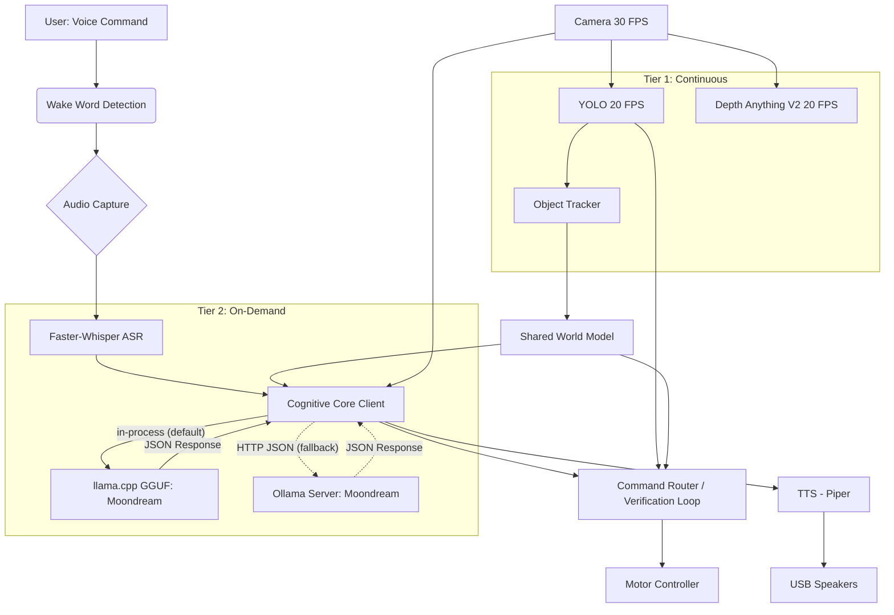

# Architecture Document: Local, Real-Time Autonomous AI Assistant
## Version 4.0 - Moondream VLM + Whisper, no-SLAM MVP

> **v4.0 scope note (24 Sep 2026).** SLAM / localization is **out of scope for the
> MVP** and has been removed from this document. The robot uses a **reactive
> "go to visible object"** behavior built on the existing Tier 1 YOLO + depth
> output (and the visual-verification loop), with **no map and no RTAB-Map
> dependency**. Revisit SLAM only if persistent multi-room memory becomes a real
> requirement. Other v4.0 changes vs 3.1: `MAXN_SUPER` power profile, an
> in-process `llama.cpp` cognitive backend now promoted to the default (Ollama
> remains available as a fallback), a visual-verification loop node, and a
> a monitoring web server (combined status + resource API, HTML dashboard).

## 1. Project Goal

The primary objective is to develop a local, real-time, multimodal AI robot assistant capable of understanding and fulfilling natural language commands with a high degree of agency. This assistant will operate entirely on the NVIDIA Jetson Orin Nano Developer Kit, leveraging a split-cognitive architecture to ensure low latency for navigation and robust reasoning for complex tasks.

### Core Capabilities:
- **Modular Multimodal Interaction**: The robot "hears" via **faster-whisper** (ASR), "sees" via camera, and reasons using **Moondream** (VLM) served via **Ollama**.
- **Two-Tier Real-Time Perception**: Continuous low-level perception (YOLO, depth estimation) runs at 20-30 FPS for reactive navigation, while strategic high-level reasoning operates on-demand via API calls to the local Ollama server.
- **Client-Server Cognitive Core**: The robot application acts as a client, sending images and text prompts to a local Ollama instance running the efficient Moondream 1.6B model for scene understanding and visual goal verification.
- **Autonomous Agency**: The robot possesses the business logic to make decisions, plan actions, handle unexpected situations, and verify task completion autonomously.
- **Local Operation**: All processing occurs on the Jetson Orin Nano, eliminating reliance on cloud services.

## 2. System Architecture

The robot's architecture is designed as a modular, layered system built upon Robot Operating System 2 (ROS2). The heavy cognitive lifting is decoupled into a local model server (Ollama).

### 2.1. High-Level Overview

The system consists of six primary layers:

1. **Hardware Abstraction Layer**: Direct interfaces with physical sensors and actuators.

2. **Tier 1 - Continuous Perception Layer**: Real-time processing at 20-30 FPS.
   - Object detection (YOLO)
   - Depth estimation (Depth Anything V2 Small)
   - Object tracking

3. **Auditory Interface Layer**:
   - Wake word detection (always-on)
   - **Speech-to-Text (ASR)**: Uses `faster-whisper` to convert audio to text.
   - Text-to-Speech for robot responses.

4. **Tier 2 - Strategic Cognitive Core (llama.cpp default / Ollama client)**: On-demand reasoning (1-3 second latency).
   - **VLM Server**: Local Ollama instance hosting Moondream (1.6B).
   - **Reasoning Node**: Python client constructing prompts with base64 images and transcribed text.
   - Outputs structured intents and visual verification results.

5. **Behavioral Architecture**: Routes commands (regex + cognitive forward) and runs the visual-verification loop.

6. **Actuation Layer**: Translates high-level commands into low-level motor controls.



### 2.2. ROS2 as the Backbone

ROS2 remains the middleware for communication between all system components.

#### Running ROS2 Nodes with Virtual Environment

**Important**: This project uses a Python virtual environment (`.venv`) for package isolation, but ROS2 `colcon build` creates executables with system Python shebangs. To run nodes properly:

**Use the provided launcher script**:
```bash
# Launch any ROS2 Python node
./launch_node.sh <package_name> <node_name>

# Example: Start audio capture
./launch_node.sh audio_interface_nodes audio_capture_node
```

**For ROS2 commands and topic monitoring**:
```bash
# Source the combined environment
source ros2_venv.sh

# Now use any ROS2 command
ros2 topic list
ros2 topic hz /audio/raw
ros2 node list
```

**Why these tools exist**:
- `launch_node.sh`: Runs ROS2 Python nodes using the venv Python interpreter (bypasses system Python shebang)
- `ros2_venv.sh`: Sources both venv and ROS2, adds venv packages to PYTHONPATH for ROS2 CLI tools
- This approach maintains Python package isolation while ensuring ROS2 functionality

**Standard workflow** (multiple terminals):
```bash
# Terminal 1 - Run a node
./launch_node.sh audio_interface_nodes audio_capture_node

# Terminal 2 - Monitor topics
source ros2_venv.sh
ros2 topic hz /audio/raw

# Terminal 3 - Run tests
source ros2_venv.sh
python manual_tests/test_audio_capture_playback.py
```

### 2.3. Tier 1: Continuous Perception Layer
(Unchanged from v3.0 - YOLO and Depth operate independently of the LLM/VLM.
Localization/SLAM is out of scope for the MVP; see the v4.0 scope note above.)

### 2.4. Auditory Interface Layer (Revised - Self-Contained Pipeline)

This layer uses a **self-contained audio processing pipeline** that handles all audio input processing locally within a single node, publishing only lightweight control messages.

#### Hardware Components
- **USB Microphone** & **USB Speakers** (Separate USB ports)

#### Audio Processing Pipeline

**1. Audio Capture & Processing Node** (`audio_capture_node.py`) - **SELF-CONTAINED PIPELINE**
   - **Audio Capture**: Captures raw audio via `arecord` subprocess (no ROS2 audio streaming).
   - **Circular Buffer**: Maintains 5-second rolling buffer for pre-roll capture.
   - **Wake Word Detection**:
     - Uses **openWakeWord** (ONNX) from https://github.com/dscripka/openWakeWord.
     - Model: Pre-trained `hey_roe_ver.onnx` included in the repository.
     - Runs continuously on every audio chunk.
     - Publishes wake word detection events to `/audio/events`.
     - **Custom Model Training**: openWakeWord provides automated utilities for training custom models:
       - **Quick Training**: Google Colab notebook with easy interface (<1 hour, no dev experience needed)
       - **Advanced Training**: Detailed notebook with full customization (higher quality, requires dev experience)
   - **Voice Activity Detection (VAD)**:
     - Uses **Silero VAD** (ONNX) via `silero-vad` package.
     - Activates after wake word detection.
     - Detects speech start/end boundaries.
     - Publishes speech events to `/audio/events`.
   - **Automatic Speech Recognition (ASR)**:
     - **Model**: `faster-whisper` (CTranslate2 backend).
     - **Size**: `tiny.en` or `base.en` (Quantized to INT8).
     - Transcribes audio segment captured by VAD.
     - **Output**: Transcribed text published to `/audio/transcription`.
     - **Performance**: <500ms for typical commands on Jetson Orin.
     - **Memory**: ~400MB RAM.
   - **State Machine**: Manages pipeline flow (IDLE → WAKE_WORD_DETECTED → RECORDING → TRANSCRIBING → IDLE).
   - **Published Topics**:
     - `/audio/events` (AudioEvent): Wake word detections, VAD events
     - `/audio/transcription` (TranscriptionResult): Transcribed text with confidence
   - **No Audio Streaming**: All audio processing happens locally; no raw audio published over ROS2.

**2. Text-to-Speech** (`tts_node.py`)
   - Uses **Piper** (ONNX).
   - Subscribes to `/audio/tts_request`.

### 2.5. Tier 2: Cognitive Core (in-process llama.cpp default; Ollama optional)

The strategic reasoning layer is reached through a single bridge abstraction
(`is_available()` / `generate(prompt, image_base64, ...) -> dict`), so the rest
of the system is agnostic to which runtime is used.

#### Backend A — in-process llama.cpp (default)
- **Library**: `llama-cpp-python` built with CUDA (`GGML_CUDA=on`, `CMAKE_CUDA_ARCHITECTURES=87`).
- **Weights**: the same `moondream:latest` GGUF blobs Ollama uses.
- **Vision**: `mtmd` clip encoder GPU-offloaded (`use_gpu=True`); the LLM context
  uses flash attention (`llm_flash_attn:=true`).
- **Flag**: `cognitive_backend:=llamacpp` (default).
- **Status**: promoted (24 Sep 2026) — faster honest vision end-to-end
  (1.92 s vs 2.61 s) and lower RSS than Ollama. See `docs/model_performance.md`.

#### Backend B — Ollama HTTP (optional)
- **Software**: **Ollama** (Linux ARM64 version).
- **Service**: Runs as a background service (`systemd`).
- **Model**: `moondream` (~1.6B parameters, 4-bit GGUF).
- **Endpoint**: `http://localhost:11434/api/generate`.
- **Flag**: `cognitive_backend:=ollama`.
- **Fallback**: if the in-process model cannot load (missing blobs /
  `llama-cpp-python`), the node automatically falls back to this backend.

#### Client Node (`cognitive_client_node.py`)

This ROS2 node bridges the robot's state with the Ollama API.

**Inputs**:
1. **Text**: Transcribed command from Whisper.
2. **Vision**: On-demand snapshot from Camera (converted to Base64).
3. **Context**: Current robot state (formatted as text string).

**Process**:
1. Receives complex command trigger.
2. Captures image from `/camera/snapshot`.
3. Encodes image to Base64.
4. Constructs prompt combining System Context + User Command.
5. Sends HTTP POST request to Ollama.
6. Parses JSON response.

**Bridge interface** (`OllamaBridge` and `LlamaCppBridge` are interchangeable):

```python
class CognitiveBridge:
    """Ollama (HTTP) and llama.cpp (in-process) expose the same surface."""
    def is_available(self) -> bool: ...

    def generate(self, prompt, image_base64=None, num_ctx=512,
                 num_predict=128, temperature=0.3, force_json=False) -> dict:
        # returns {"response": str, "model": str, "total_duration": int_ns,
        #          "eval_count": int, "prompt_eval_count": int}
        # or {"error": str} on failure
        ...
```

The JSON intent schema is enforced by the llama.cpp backend with a GBNF
grammar / `response_format={"type": "json_object"}`; `parse_json_intent()` is
kept as a defensive fallback for the Ollama path.

#### Output Formats

**Structured Intent (Parsed from response)**:
```json
{
  "action": "navigate",
  "target": "red ball",
  "explanation": "I see a red ball on the floor to the left."
}
```

#### Performance Targets (measured on-device under MAXN SUPER)
- **Vision encode (Moondream)**: 24 ms.
- **Generation Speed**: 49.0 tokens/sec.
- **Total Turnaround**: ~1.3 seconds.

(Detailed numbers and the 15 W baseline: `docs/model_performance.md`.)

### 2.6. Behavioral Architecture

No BehaviorTree.CPP for the MVP. A lightweight `command_router_node` keeps the
regex + cognitive-forward pattern, and a `visual_verification_node` closes the
goal-completion loop.

**Logic Flow**:
1. **Simple command?** (regex match on Whisper text) -> execute directly via `/cmd_vel`.
2. **Complex command?** -> cognitive core with the current frame -> parse intent -> execute.
3. **Goal issued** (navigate/search) -> `visual_verification_node` stops, asks the
   cognitive core "is goal X achieved?", and retries with ±45° rotation if unsure.

### 2.7. Actuation Layer
(Unchanged - UART to Wave Rover).

## 3. Operational Flow Examples

### 3.1. Example: "Go to the red ball"

```
T=0.0s: User: "Hey Rover"
        → openWakeWord triggers recording

T=0.1s: User: "Go to the red ball"
        → Audio captured (1.5s)

T=1.6s: Audio Processing
        → Faster-Whisper transcribes: "Go to the red ball"
        → Published to /audio/transcription

T=1.8s: Command Routing
        → Regex check fails (not a simple "stop" command).
        → Routed to Cognitive Client.

T=1.9s: Context Assembly
        → Camera snapshot captured & Base64 encoded.
        → Prompt built: "User said 'Go to the red ball'. Identify target in image."

T=2.0s: Ollama Inference (Moondream)
        → Request sent to localhost:11434
        → Moondream analyzes image.
        → Output: "{"action": "navigate", "target": "red ball", "visual_confirm": true}"

T=3.5s: Inference Complete (1.5s total duration)
        → Client parses JSON.
        → Publishes intent to the command router.

T=3.6s: Execution (reactive, no map/SLAM)
        → Command router turns toward / approaches the visible target.
        → Visual-verification loop confirms arrival (or retries with rotation).
```

### 3.2. Example: Visual Verification ("Am I there?")

```
T=0.0s: Robot reaches coordinate target.
T=0.1s: Visual verification node requests verification.
T=0.2s: Cognitive Client calls the configured backend.
        → Image: Current view.
        → Prompt: "Is there a red ball in the center of this image? Answer Yes/No."
T=1.0s: Moondream responds: "Yes, a red ball is visible."
T=1.1s: Task marked Complete.
```

## 4. Memory Management Strategy

The Jetson Orin Nano has 8GB shared RAM. This architecture uses a "Static Load" strategy for efficient models (Whisper/Moondream) rather than the heavy loading/unloading of Gemma.

### 4.1. Revised RAM Budget

| Component | RAM Usage | Notes |
|-----------|-----------|-------|
| **OS + ROS2 Core** | 1.2 GB | Ubuntu + Middleware |
| **Tier 1 (YOLO + Depth)** | ~1.5 GB | Optimized TensorRT engines + buffers (estimate) |
| **Ollama Service (Idle)** | 0.2 GB | Service overhead |
| **Moondream Model (Loaded)** | 1.8 GB | 4-bit Quantized (keeps resident) |
| **Faster-Whisper** | 0.5 GB | `base.en` INT8 |
| **TTS (Piper)** | 0.2 GB | |
| **Buffers/Overhead** | 1.0 GB | Camera buffers, message queues |
| **TOTAL** | **~6.4 GB** | **Fits in 8GB** (SLAM removed from v3.1 budget) |

> Measured reality: the `ollama` process peaks at **~3.0 GB** with Moondream
> resident (higher than the 2.0 GB service+model estimate above), and idle
> `available` RAM is ~6 GB. See `docs/phase0_baseline.md` and
> `docs/model_performance.md`.

**Strategy**:
1. **Ollama** keeps Moondream loaded (set `keep_alive` to -1 or a long duration in API options).
2. **Faster-Whisper** is small enough to stay loaded or can be loaded on wake-word detection.
3. If RAM pressure hits >95%, the system reduces camera resolution/buffers before touching the cognitive core.

## 5. Model Optimization Strategy

### 5.1. Vision & Reasoning (Moondream via Ollama)
- **Format**: GGUF (4-bit quantization).
- **Optimization**: Ollama automatically utilizes the Orin Nano GPU (via CUDA/JetPack libraries if configured correctly).
- **Settings**:
  - `num_ctx`: 2048 (Sufficient for image + prompt).
  - `num_predict`: 128 (Prevent long hallucinations).

### 5.2. Speech (Faster-Whisper)
- **Format**: CTranslate2 (INT8).
- **Optimization**: Runs efficiently on CPU or GPU. Given the VLM uses GPU, running Whisper on CPU (4 cores) is acceptable to save VRAM, or strictly limit its GPU memory allocation.

### 5.3. Perception (YOLO/Depth)
- **Format**: TensorRT FP16 (DeepStream).
- **Optimization**: These run on the DLA (Deep Learning Accelerator) if possible, or GPU.

## 6. Tech Stack

### 6.1. Hardware
- **Main Compute**: NVIDIA Jetson Orin Nano (8GB).
- **Robot Platform**: Wave Rover.

### 6.2. Software & Frameworks
- **OS**: Ubuntu 22.04 (JetPack 6.x preferred for newer Ollama support).
- **Middleware**: ROS2 Humble/Iron.
- **LLM Server**: **Ollama** (Linux).
- **ASR**: **faster-whisper** (Python).
- **VLM**: **Moondream** (via Ollama).
- **Vision**: DeepStream / TensorRT.

## 7. Development Best Practices

### 7.1. Ollama Management
- Create a `systemd` service for Ollama to ensure it starts on boot.
- Use a startup script to "pull" and "preload" the Moondream model so the first command isn't delayed.
  - `curl http://localhost:11434/api/generate -d '{"model": "moondream"}'` (Empty prompt to load weights).

### 7.2. Prompt Engineering
Moondream is small. Prompts must be direct.
- **Bad**: "Please analyze this image and tell me if you can see a ball and where it is."
- **Good**: "Describe this image. JSON output: {'object': 'red ball', 'location': 'center'}."

## 8. Safety and Recovery
(Unchanged).

## 9. Testing Strategy

### 9.1. Cognitive Benchmarking
Use the provided python snippet logic to benchmark Moondream specifically on the Jetson.
- **Metric**: Tokens per second (TPS). Target > 10 TPS.
- **Metric**: Vision Encode Time. Target < 500ms.

### 9.2. ASR Testing
Test `faster-whisper` with robot motor noise.
- May need to apply noise suppression (WebRTC VAD or RNNoise) before the Whisper step if motor noise is high.

## 10. Project Structure Updates

```
robot_assistant_project/
├── src/
│   ├── cognitive_core_nodes/
│   │   └── cognitive_core_nodes/
│   │       ├── cognitive_client_node.py (NEW - Ollama Bridge)
│   │       └── json_parser.py (NEW)
│   ├── audio_interface_nodes/
│   │   └── audio_interface_nodes/
│   │       ├── asr_node.py (NEW - Faster-Whisper)
│   │       └── ...
...
├── scripts/
│   ├── install_ollama.sh
│   └── pull_moondream.sh
...
```

## 11. Key Architectural Decisions

### 11.1. Moondream over Gemma 3n
**Rationale**: Gemma 3n proved too heavy for the 8GB RAM when combined with YOLO and depth perception. Moondream (1.6B) is significantly smaller, designed specifically for edge VLM tasks, and serves rapidly via Ollama.

### 11.2. Faster-Whisper Integration
**Rationale**: By splitting ASR from the VLM, we gain modularity. Whisper is the industry standard for robust offline ASR. The "Faster" implementation (CTranslate2) is highly optimized for resource-constrained devices.

### 11.3. In-process llama.cpp (default), with Ollama as the optional fallback
**Rationale**: Running Moondream in-process removes the HTTP/JSON/base64 round trip and the separate daemon, and with flash attention plus GPU `mtmd` vision it is the fastest honest vision path on the Orin (1.92 s vs 2.61 s) with lower RSS. The Ollama HTTP path is retained as an automatic fallback and for easier model swapping (e.g., trying `llava-phi3` or `tiny-llava`) without changing code; `cognitive_backend:=ollama` selects it.

## 12. Implementation Roadmap (Adjusted)

### Phase 3: Audio Pipeline (Weeks 5-6)
- Implement `faster-whisper` node.
- Validate transcription accuracy with motor noise.

### Phase 4: Cognitive Core (Weeks 7-9)
- Install Ollama on Jetson Orin Nano.
- Pull and quantize/verify `moondream`.
- Develop `cognitive_client_node.py`.
- Optimize prompts for JSON output.


### Phase 5: Behavioral Architecture (Weeks 10-12)

> **As built (v4.0)**: BehaviorTree.CPP was **not** adopted. The command router
> (regex + cognitive forward) plus a dedicated `visual_verification_node` cover
> this phase. The original BT framing is retained only for context.

**Goals**: Integrate the asynchronous cognitive client with reactive command routing.

**Tasks**:
1.  **JSON Intent Parser**: retained in `cognitive_client_node.py` (markdown-fence stripping + validation), with a GBNF / `response_format` JSON path on the llama.cpp backend.
2.  **Async handling**: queries run off the executor callback (in-process llama.cpp) or over a keep-alive HTTP session (Ollama) — no blocking behavior-tree tick.
3.  **Visual Verification Logic** (`visual_verification_node.py`):
    - Stops the robot.
    - Asks the cognitive core: *"Is the goal [X] achieved in this image?"*
    - Retries with ±45° rotation if unsure, up to `max_attempts`.

**Deliverables**:
- `command_router_node.py` + `visual_verification_node.py`.
- Robust error/timeout handling for the cognitive backend.

### Phase 6: Integration & Testing (Weeks 13-14)

**Goals**: Full system integration and validation of the Client-Server latency.

**Tasks**:
1.  **Latency Tuning**: Measure the time from "Voice Command" to "Action Start".
    - *Optimization*: Adjust `faster-whisper` beam size (reduce to 1 for speed).
    - *Optimization*: Pre-warm the Moondream model on boot.
2.  **Memory Stress Test**: Run YOLO + Depth + Ollama inference simultaneously. Monitor swap usage.
3.  **Real-world Scenarios**: Test specific prompts like "Find the bottle" to see if Moondream (1.6B) has sufficient semantic knowledge compared to larger models.

**Deliverables**:
- System configuration file optimized for 8GB RAM.
- Benchmark report comparing "Cold Start" vs "Warm" inference times.

### Phase 7: Optional Enhancements (Post-MVP)

**Goals**: Advanced features leveraging the modularity of Ollama.

**Tasks**:
1.  **Model Swapping**: Create a script to dynamically swap models via the Ollama API (e.g., unload `moondream` and load `llama3-chatqa` for text-only queries if high-resolution reasoning is needed).
2.  **Context History**: Implement a sliding window of previous conversation turns in the `cognitive_client_node` to give Moondream "short-term memory."

## 13. Performance Targets Summary (Revised for V3.1)

### Tier 1 - Continuous Perception
| Metric | Target | Notes |
|--------|--------|-------|
| YOLO Detection | 20+ FPS | DeepStream / TensorRT |
| Depth Anything V2 | 20+ FPS | TensorRT FP16 |

### Tier 2 - Strategic Reasoning (Ollama + Whisper)
| Metric | Target | Notes |
|--------|--------|-------|
| ASR Transcription | < 0.5s | Faster-Whisper (`tiny.en` or `base.en`) |
| Vision Encode | < 0.3s | Base64 encoding + network overhead |
| **VLM Inference** | **15-20 tok/s** | Moondream (1.6B) on GPU |
| **Total Response** | **< 2.5s** | From end of speech to behavior trigger |
| VLM Context | 2048 tokens | Sufficient for image + system prompt |

### End-to-End System
| Metric | Target | Notes |
|--------|--------|-------|
| Peak RAM Usage | < 7.5 GB | Leaving ~500MB headroom for OS |
| Thermal Stability | < 80°C | During continuous inference loops |

## 14. Future Enhancements

### Short-Term (Post-MVP)
- **Dynamic Quantization**: Experiment with different quantization levels of Moondream (q4_k vs q5_k) in Ollama to find the sweet spot between accuracy and speed.
- **Voice Activity Detection (VAD) Tuning**: Integrate `silero-vad` before Whisper to ensure we only transcribe actual speech, saving CPU cycles.

### Medium-Term
- **Upgrade to LLaVA-Phi-3**: If memory allows (or if newer, smaller versions release), replace Moondream with LLaVA-Phi-3 (3.8B) for significantly better reasoning, though this may require pausing continuous perception during inference.
- **Spearker Identification**: Use `pyannote-audio` (if resources permit) to identify *who* is giving commands.

### Long-Term
- **RAG Integration**: Use Ollama's embedding capabilities to allow the robot to "read" a manual or map definition file to better understand context about its environment.

## 15. Known Limitations & Mitigations

### 15.1. Moondream Model Size (1.6B)
**Limitation**: Moondream is a "Tiny" VLM. It has excellent object recognition but poor "world knowledge" and complex reasoning capabilities compared to Gemma 3n (5B) or GPT-4o.
**Mitigation**:
- **Prompt Engineering**: Use very strict, simple system prompts. Do not ask for complex analysis. Ask for "Identification" and "Location".
- **Verification Loop**: If the robot is unsure, program it to rotate 45 degrees and ask again (ensemble the results).

### 15.2. HTTP Overhead
**Limitation**: Using HTTP requests (Ollama) adds slight latency (10-50ms) compared to direct in-memory function calls.
**Mitigation**: Use `requests.Session()` in Python to keep the TCP connection open (Keep-Alive), minimizing handshake overhead.

### 15.3. ASR Errors
**Limitation**: `faster-whisper` (tiny/base) may struggle with unique words or heavy motor noise.
**Mitigation**:
- **Prompting Whisper**: Pass a list of "initial_prompt" keywords to Whisper (e.g., "robot, navigate, kitchen, bottle") to bias it towards expected vocabulary.

## 16. Safety Considerations

### 16.1. Emergency Stop Separation
**Critical Decision**: The "Emergency Stop" command must **bypass** the ASR->Ollama pipeline.
- **Implementation**: The Wake Word detector (openWakeWord) should look for "STOP" specifically as a trigger word that immediately publishes `cmd_vel = 0`, rather than waiting for Whisper to transcribe "Stop" and the LLM to process it.

### 16.2. Fail-Safe for API
- If the Ollama server crashes or hangs, the `CognitiveClient` node must detect the timeout (e.g., > 5 seconds).
- **Action**: Switch robot to "Safe Mode" (Audio warning: "Cognitive core unresponsive"), stop motors, and attempt to restart the Ollama service via `subprocess`.

## 17. Conclusion

Architecture Version 3.1 represents a pragmatic pivot from the "all-in-one" Gemma 3n approach to a **modular, service-oriented architecture**. By leveraging **Ollama** to serve the highly efficient **Moondream** model, and **Faster-Whisper** for dedicated speech recognition, this design:

1.  **Respects Hardware Limits**: Fits comfortably within the Jetson Orin Nano's 8GB RAM by using optimized quantization and splitting workloads.
2.  **Improves Modularity**: Allows individual components (ASR, VLM) to be upgraded or swapped without rewriting the core application logic.
3.  **Maintains Autonomy**: Keeps all processing local (offline), preserving privacy and ensuring operation without internet access.

While Moondream (1.6B) has lower reasoning bounds than Gemma (5B), its speed and low footprint make it the superior choice for a responsive, real-time robot assistant on this specific hardware class. The command router plus visual-verification loop keep the robot safe and reactive even if the high-level reasoning momentarily falters.

## References

-   **Ollama**: [https://ollama.com](https://ollama.com)
-   **Moondream (HuggingFace)**: [https://huggingface.co/vikhyatk/moondream1](https://huggingface.co/vikhyatk/moondream1)
-   **Faster-Whisper**: [https://github.com/SYSTRAN/faster-whisper](https://github.com/SYSTRAN/faster-whisper)
-   **Robot Operating System 2**: [https://docs.ros.org/en/humble/](https://docs.ros.org/en/humble/)
-   **Jetson AI Lab**: [https://www.jetson-ai-lab.com/](https://www.jetson-ai-lab.com/) (Tutorials on running VLMs on Jetson)
-   **Depth Anything V2**: [https://github.com/DepthAnything/Depth-Anything-V2](https://github.com/DepthAnything/Depth-Anything-V2)
